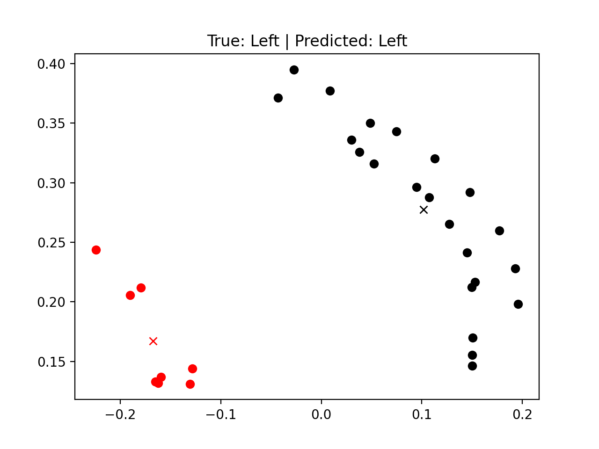
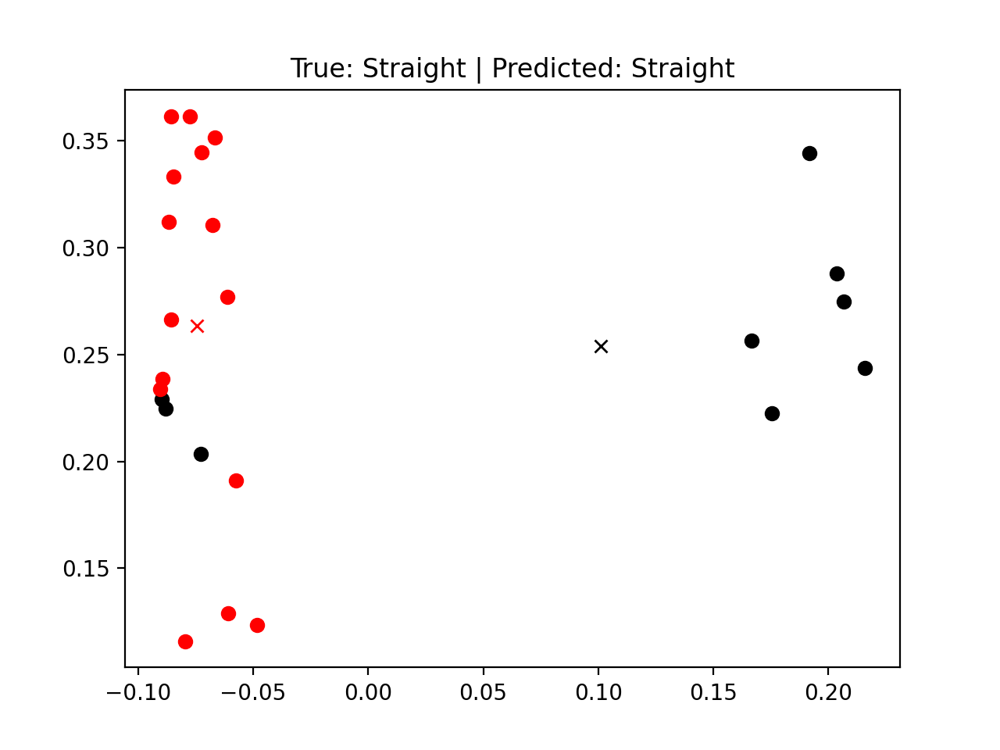
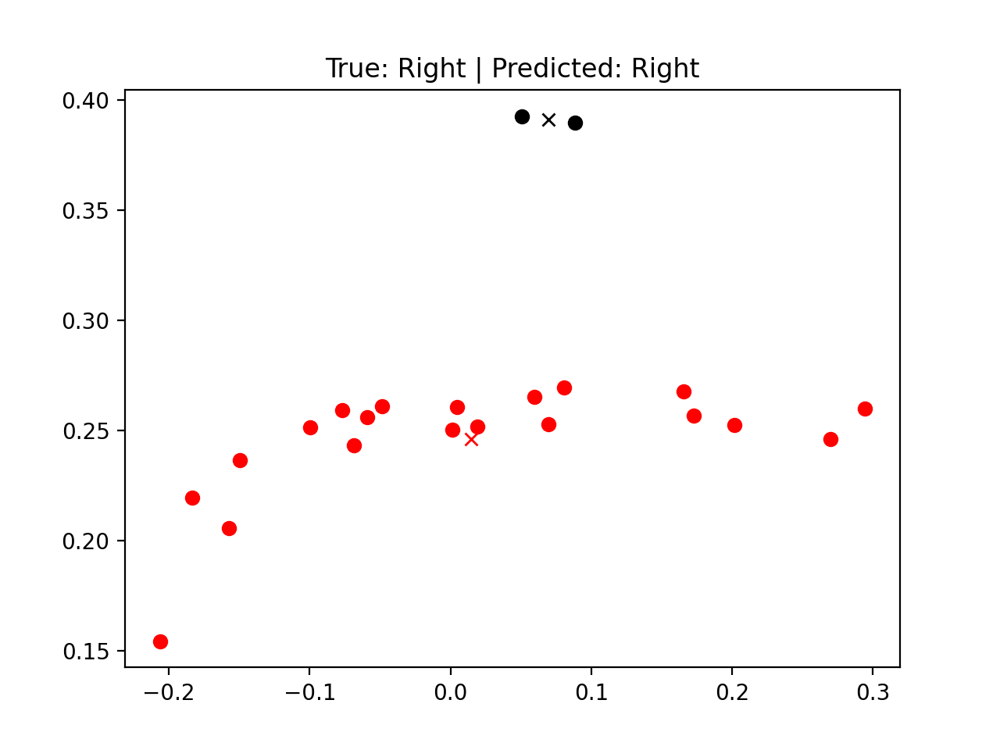
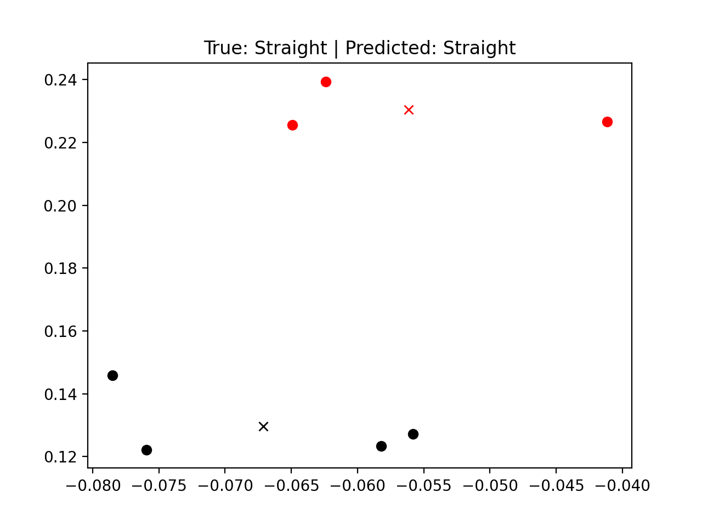
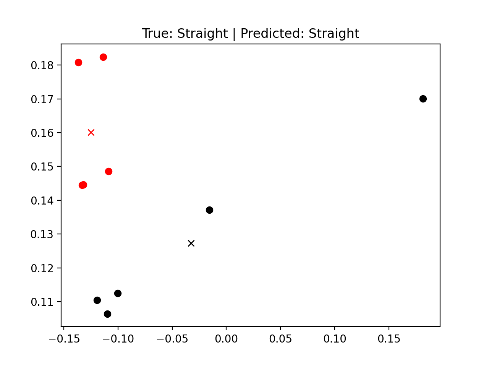
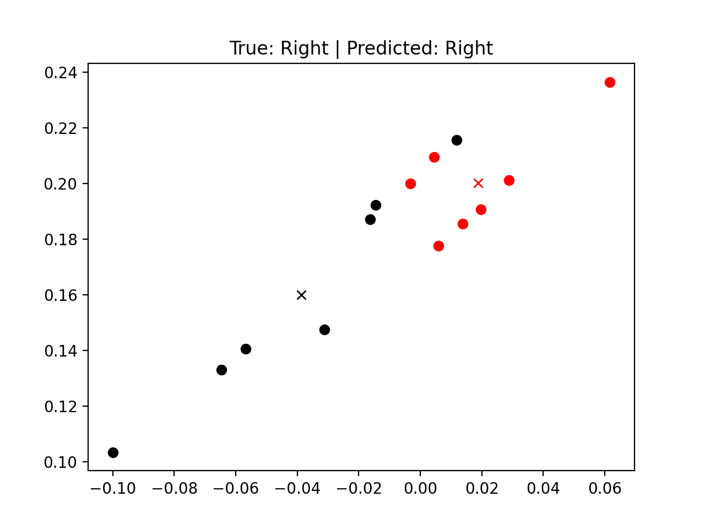
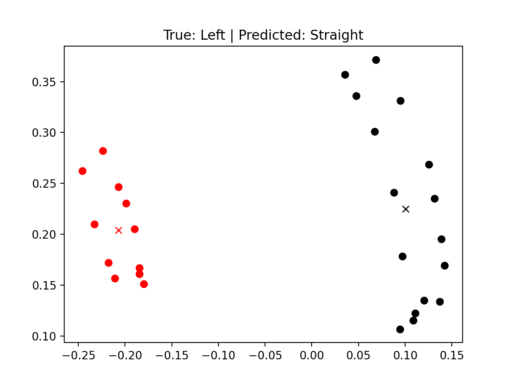
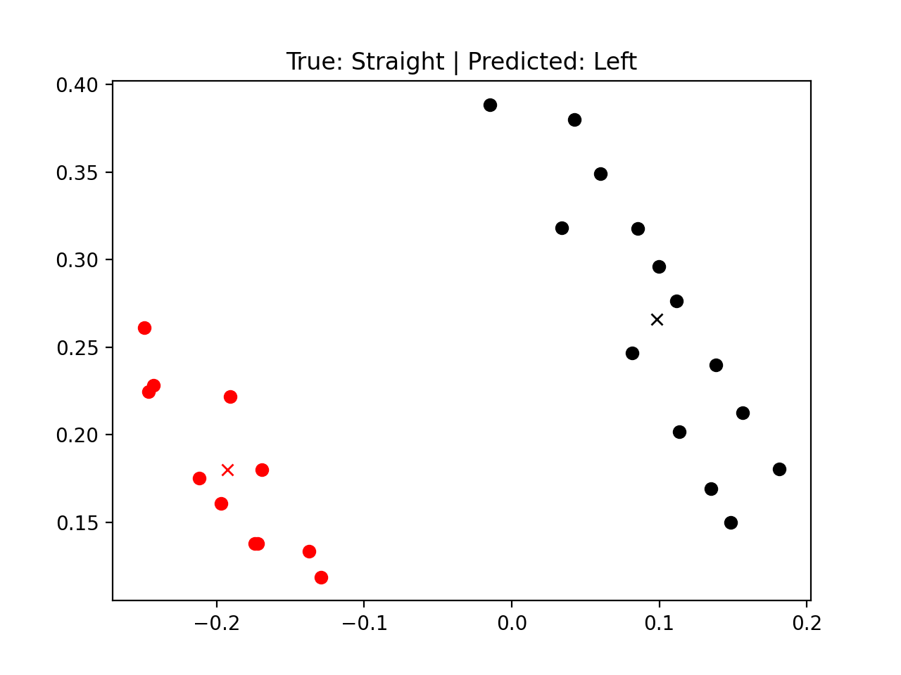

#  Lisus: Assignment 3 {#lisus-assignment3 status=ready}

## The Final Result {#lisus-assignment3-final-result}

The goal of this assignment was to train a Gaussian Process (GP) model to predict the state of the lane that the Duckiebot is currently in. The final results of the GP performance is shown below. The visualization shows the detected white (in black) and yellow (in red) lane segments with an x marking the average position of each type of segments. The true and predicted lane state is listed in the title. Please refer to [instructions to reproduce](#instructions-lisus-assignment3) to reproduce these results.

<figure class="flow-subfigures">       
  <figcaption>Examples of succesfully predicted states.</figcaption>     
  <figure>         
    <figcaption>Left state</figcaption>         
         
  </figure>     
  <figure>           
    <figcaption>Straight state</figcaption>         
         
  </figure> 
  <figure>           
    <figcaption>Right state</figcaption>         
         
  </figure> 
</figure>

## Mission and Scope {#lisus-assignment3-final-scope}

The mission was to take the detected white and yellow line segments and to use them as inputs to predict whether the current lane is in a "straight", "left", or "right" portion. 

### Motivation {#lisus-assignment3-final-result-motivation}

A large number of control algorithms could greatly benefit from knowing which part of the lane the robot is in. In fact, I used a more "hacky" estimator, described in the [next section](#lisus-assignment3-final-literature), for both Assignment 1 and Assignment 2. 

In Assignment 1, we were tasked with coding up a simple pure-pursuit controller. My solution relied on finding the white and yellow lanes in front of the robot, and then placing a target point in between the two lanes at some desired distance. Issues arose when only one of the lanes was detected. When this happened, I could blindly place the target point at half the lane width to the left of the white line or at half the lane width to the right of the yellow line. However, this would work only in a straight portion of the lane, as during turns the lanes could be almost entirely horizontal and placing a target point to the left or the right would yield a target that was on the lane itself. As such, when I was able to detect that I was in a left turn for example, I could instead place the target below the detected white line instead of the left of it, yielding much better performance.

In Assignment 2, I used a simple PID controller with an estimator of the robots pose in the lane in order to achieve lane following. I wanted the robot to go as fast as possible, however this frequently yielded problems with the bot flying off the road during turns. As such, knowing the state of the lane allowed me to do simple gain scheduling which made the robot be able to turn sharper and drive slower only during turning portions.

In both of these cases, the robustness and performance of my algorithms was greatly improved by incorporating knowledge about whether the lane was going straight, turning left or turning right.

### Existing solution {#lisus-assignment3-final-literature}

There has not previously been an explicit lane state estimator which estimated whether the lane was going straight or turning left or right. I coded up such an estimator for Assignment 1 and used it also in Assignment 2. However, this previous estimator was simply a large number of "if-else" statements and thus very bug-prone and not robust.

### Opportunity {#lisus-assignment3-final-opportunity}

Although I coded up a functional "brute-force" lane state detector, it was extremely error prone during non-standard line detection situations. As such, I would frequently have to figure out what cases I missed and include additional checks and balances in my code to accommodate them.

Instead of doing this, I thought that a simple learning algorithm such as a Gaussian Process would be well suited to tackle this problem. With enough training samples, the algorithm would in theory learn to recognize essentially all possible line detection outliers and incorporate them into the prediction. This would not only improve the robustness and performance of the algorithm, but also greatly decrease the amount of code required to be run and debugged in algorithms that make use of the lane state detection prediction.

## Background and Preliminaries {#lisus-assignment3-final-preliminaries}

The only background required above the basic understanding of the functionalities of the duckiebot and line detections is knowing what a Gaussian Process (GP) is. For this problem, I used the publicly available *scikit learn GaussianProcessClassifier* python library to do the hard work for me. As such, it is not necessary to understand the in-depth math behind GPs, and the reader is heavily referred to the informally called *Gaussian Process Bible* by Rasmussen and Williams which summarizes Gaussian Processes in-depth (actual reference: *Carl Edward Rasmussen and Christopher K. I. Williams. 2005.* *Gaussian Processes for Machine Learning (Adaptive Computation and Machine Learning)**. The MIT Press.*). However, below is a quick overview of the method.

Specifically, this solution makes use of Gaussian Processes for Classification, as opposed to the arguably more commonly used Regression. In the Classification task, we aim to find some functional relationship between inputs $\mathbf{x}$ and an output $y$, which belongs to some list of categories $\mathbf{y}$. For our situation, the $\mathbf{x}$ is the properties of the currently seen white and yellow segments (such as their average position) and $\mathbf{y}$ is simply the options "straight", "left", and "right". Effectively, for some segment information input, we want the algorithm to predict which of the options is most likely to correspond to this input. GPs use a much simpler approach than other machine learning methods and simply compare newly provided inputs to previously known input-output relations in order to predict a new output. As such, training involves learning the parameters of the function, called the kernel, which evaluates this "closeness" between new and known inputs. Once these parameters are learned, the GP is able to use this kernel to evaluate new inputs and predict an output based on how closely related the new input is to known inputs during training. As a downside, the GP approach does require the user to keep track of all inputs used during training. For this problem however, this does not prove to be a barrier as the inputs are very small and the simplicity of the problem requires only a couple hundred training samples.

## Definition of the problem {#lisus-assignment3-final-problem-def}

_Up to now it was all fun and giggles. This is the most important part of your report: a crisp, possibly mathematical, definition of the problem you tackled. You can use part of the preliminary design document to fill this section._

**Final Objectives/Deliverables**

- Predict whether the lane portion the bot is currently in is going "straight", "left", or "right" based on detected yellow and white lane segments. This prediction should be tested in simulator and on the real robot.
- Produce a method to collect training data for the mission.
- Produce a trained model which can be loaded directly into a control algorithm.

**Assumptions:**

- The algorithm is not expected to function when the robot is not between a yellow and white line.
- The algorithm is not expected to function in situations where the robot is not decently positioned even when it is between a yellow and white line. Examples include
  - The robot is more than ~45 degrees declined from the correct flow of traffic in a lane, and
  - The robot is backwards with the yellow line on the right and the white line on the left.

**Performance Metrics**{#lisus-assignment3-final-problem-def-performance-metrics}

Performance of the Gaussian Process algorithm will be evaluated on a collected test set of both simulated and real world examples. This test set will have user specified true lane states and these will be compared against the lane states predicted by the algorithm to calculate a percent success rate. This success rate will be evaluated for only simulated results, only real world results, and for a combination of the two.

As a more qualitative metric, the GP will be implemented in a pure-pursuit algorithm in order to verify its ability to predict the lane state in an online manner. Since the lane state prediction will only be indirectly measured by the performance of the controller, no numerical conclusions will be made from this.

## Contribution / Added functionality {#lisus-assignment3-final-contribution}

Describe here, in technical detail, what you have done. Make sure you include:
- a theoretical description of the algorithm(s) you implemented
- logical architecture
- software architecture
- details on the actual implementation where relevant (how does the implementation differ from the theory?)
- any infrastructure you had to develop in order to implement your algorithm
- If you have collected a number of logs, add link to where you stored them

_Feel free to create subsections when useful to ease the flow_

**Data Recording**

The first step to accomplish this project was the develop data recording infrastructure. For a given recording, I needed to save the

- White lane segments + stats (such as average point, closest point, furthest point)
- Yellow lane segments + stats (such as average point, closest point, furthest point)
- The user-specified state of the lane

The exact procedure to record new data is described in the [instructions to reproduce](#instructions-lisus-assignment3), however it should be very easy to expand this procedure to record other data if a more complex machine learning approach would want to be tried. The collected data is saved as a JSON file and the collected JSON files from the simulator and real world can be accessed at https://github.com/lisusdaniil/dt-exercises/tree/daffy/lane_state_prediction/exercise_ws/data. 

**GP Training**

The next step in the development process and also another stand-alone deliverable is the actual training runfile. This file loads in any number of training and testing JSON files collected using the method listed in Data Recording above and subsequently trains and tests a GP model. It also provides an option to save the trained model using the *pickle* python library and also provides an option to load in a pickled model instead of training a new one. 

Additionally, this function is also capable of augmenting the data. This is done using two approaches:

1. For recordings where both white and yellow segments are available, new training points are created using only the white and only the yellow lines with the same corresponding lane state. Thus, for every training point which has both white and yellow segments, 2 additional augmented training points are possible.
2. For data recorded during turning lane states, augmented training points can be generated by simply flipping the horizontal coordinates of the segments and changing the turn type. This is possible since the segments for a left turn and the segments for a right turn are simply horizontally flipped versions of each other. As such, for every training point corresponding to a turn, 1 additional augmented training point is generated.

Although data augmentation is implemented, it was not found to produce any additional benefits and thus was not used for training. Potentially in a more complex scenario it could be useful however.

The training runfile can be accessed at https://github.com/lisusdaniil/dt-exercises/blob/daffy/lane_state_prediction/train_GP.py.

**GP Prediction in Unrelated Algorithm**

Finally, an implementation of the trained GP model in a control algorithm is also provided. The algorithm is the same pure pursuit algorithm as the one described in [the motivation section](#lisus-assignment3-final-result-motivation). The previous brute-force method has been switched out for the GP implementation for predicting the lane state. Although the controller node used in the code also contains the data collection functions for the sake of this assignment, the inclusion of the GP to predict the lane state is completely independent from the data collection. As such, by simply including a subsriber to the */ground_projection_node/lineseglist_out* topic and doing some segment pre-processing it is possible to include the GP prediction in any algorithm! The function triggered through the line */ground_projection_node/lineseglist_out* topic does the pre-processing and calls a saved GP model to produce a predicted direction. Depending on the need, a user can either create a new publisher or simply use the direction in the current node as was done for this implementation. The reader is again referred to the more detailed [instructions to reproduce](#instructions-lisus-assignment3).

The full folder implemented using the *dt-exercises* approach can be found at https://github.com/lisusdaniil/dt-exercises/tree/daffy/lane_state_prediction.

## Formal performance evaluation / Results {#lisus-assignment3-final-formal}

As stated in [the performance metrics section](#lisus-assignment3-final-problem-def-performance-metrics), qualitative metrics were evaluated on the GP performance using a direct testing set of simulated and real world collected datasets. Note that the model itself was trained using data from both the simulator and the real world. The results are shown below

<col2 figure-id="tab:mytable" figure-caption="Results"> Test Type    Accuracy    Sim    88-93%    Real    70-85%  Both  82-88%</col2>

As can be seen, the algorithm performs quite well in both simulated and real world situations. Since GPs are stochastic processes, both the model training and model testing produce slightly different results depending on the given run. As such, several tests were run leading to the indicated ranges. It should be noted that the only reason that the real world performance is so much lower is due to the more unpredictable line detection. Particularly, my testing location was different from where I had previously calibrated my robots colour detection. However, even in these absurdly poor conditions, as can be seen in the noisy images below, the GP is capable of correctly predicting the majority of the results. As such, it is expected that with better calibrations the real world perfromance should be equivalent to that of the simulator.

<figure class="flow-subfigures">       
  <figcaption>Examples of succesfully predicted noisy real-world segments.</figcaption>     
  <figure>                 
         
  </figure>     
  <figure>                  
         
  </figure> 
  <figure>                 
         
  </figure> 
</figure>

Additionally, it should also be noted that many of the errors present in the testing set were arguably not errors from the perspective of our goal. As can be seen in the images below, in the True: Straight case where the GP predicts a left turn, a controller should probably be trying to more aggressively turn left given the clear deviation from the center. Likewise in the True: Left case, there does not appear a need to be rapidly turning left and straight controller gains would likely be preferred.

<figure class="flow-subfigures">       
  <figcaption>Examples of incorrect simulator predictions.</figcaption>     
  <figure>                 
         
  </figure>     
  <figure>                  
         
  </figure> 
</figure>

## Future avenues of development {#lisus-assignment3-final-next-steps}

Although the project meets the desired level of accuracy, there are a few additions which could be attempted. They are:

* Implement a proper validation set to ensure that the GP is being fully trained rather than the informal tests performed which amounted to "I am adding more training points with no visible benefits, therefore we are done."
* Train the GP using more than just the average, minimum and maximum values of each type of line segment.
* Train the GP to predict additional classes such as "approaching a left turn" and "approaching a right turn".
* Implement additional data augmentation such as randomly ignoring a certain number of segments and creating new training points from the rest.