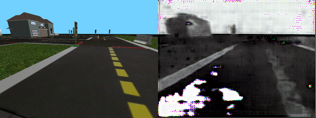
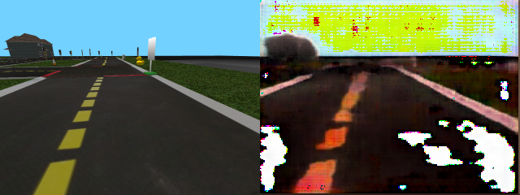
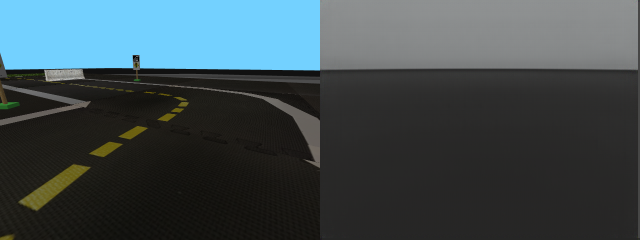

# Instructions template {#instructions-improving-rl-baseline status=ready}

Requires: Python 3.6+

Requires: PyTorch 1.7.x

Requires: Access to a Nvidia GPU (locally or remotely)

## Images of expected results {#demo-improving-rl-baseline-expected}

You should expect to get results similar to the following by training the DAE for 150 epochs and continuing for another 150 epochs on images of size 240 * 320.

<figure>
    <figcaption>Reconstruction of the image by the DAE after training over 150 epochs with a learning rate of `0.001` and `adam` optimizer. On the left, we can see the original image. On the right is the image generated by the DAE.</figcaption>
    
</figure>

<figure>
    <figcaption>Reconstruction of the image by the DAE after training over 300 epochs with a learning rate of `0.001` and `adam` optimizer. On the left, we can see the original image. On the right is the image generated by the DAE.</figcaption>
    
</figure>

You should expect to get results similar to the following by training the $beta$-VAE for 150 epochs on images of size 240 * 320 with a latent dimension of 128 and without using the DAE for the loss.

<figure>
    <figcaption>Reconstruction of the image by a $beta$-VAE after training over 150 epochs with a learning rate of `0.0005`, a latent dimension of 128 and `adam` optimizer without using a DAE for the loss.
Left: original image, Right: VAE reconstruction of the original image. </figcaption>
    
</figure>

## Laptop setup notes {#demo-improving-rl-baseline-laptop-setup}

If you are using a local Nvidia GPU, be sure to have access to it with PyTorch.

To test it, open a python session within your development environment.

Then, import PyTorch and check if the GPU is available:

    laptop >>> import torch
    laptop >>> "cuda" if torch.cuda.is_available() else "cpu"

If you get `cuda`, you're ready to go. Otherwise, you have to check your PyTorch installation and be sure that you have a CUDA enabled version of PyTorch and that the required CUDA version matches the version of the library installed on your laptop. If you have to reinstall it, go on PyTorch website for [instructions](https://pytorch.org/get-started/locally/).

## Duckietown setup notes {#demo-improving-rl-baseline-duckietown-setup}

Nothing special about the duckietown setup is required beforehand to reproduce the results. The required Duckietown map used in the simulator is available under `duckietown_rl/maps/dataset_generator.yaml`.

## Duckiebot setup notes {#demo-improving-rl-baseline-duckiebot-setup}

### Initializing the project directory

To initialize the project directory follow the instructions below.

Clone the project repo.

    laptop $ git clone https://github.com/melisandeteng/challenge-aido_LF-baseline-RL-sim-pytorch.git

Get into the project directory.

    laptop $ cd challenge-aido_LF-baseline-RL-sim-pytorch

Checkout the `darla` branch.

    laptop $ git checkout darla

Install the requirements.

    laptop $ python3 -m pip install -r requirements.txt
 
 Then, initialize the submodules. 

    laptop $ git submodule init
    laptop $ git submodule 
    laptop $ update

### Config file

Enter the `DARLA` directory.

    laptop $ cd DARLA

You might want to copy the default configuration file `config/defaults.yaml` or edit the file directly.

The following table summerize the configuration values that are either not straight forward or that you most likely will have to change.

Option | Description
--- | ---
`output_path` | the location of the output files
`module` | which neural network to train
`save_n_epochs` | the checkpoint interval
`data:loaders:batch_size` | number of element per batch
`data:loaders:num_workers` | number of worker for the loader
`data:files:base` | the location of the file listing examples
`data:files:train` | file listing examples
`data:shape` | the shape of the images in format channel, height, width
`comet:api_key` | the commet key associated with your account
`comet:project_name` | the commet name of your project
`comet:workspace` | the commet workspace of your project

Be sure to check the configuration file values. The default values related to the model were chosen to fit the original DARLA paper . The other values are generic values that you might want to tune. In particular, if your GPU has access to a lot of RAM you might want to increase the `data:loaders:batch_size` value (up to 32 for a 6 Gb GPU for example). If your CPU has several cores, you might want to increase the `data:loaders:num_workers` value (1 per virtual core for example).

If you want to use [Comet ml](https://www.comet.ml/) to visualize you training statistics, then set the values under the `comet` section of the config file. 

Note: if you change the size in `shape`, set the same size in the resize transform section of the config file and set the `ignore` flag of this transform to `false`.

## Pre-flight checklist {#demo-improving-rl-baseline-pre-flight}

The code is in Python 3.6 and use PyTorch 1.7.1.

## Instructions {#demo-improving-rl-baseline-run}

First, will be the dataset generation. Then, will come the perceptual model training.

### Collecting your dataset

To collect the dataset from the source of the project directory follow the instructions below.

Enter the RL directory.

    laptop $ cd duckietown_rl

Generate the dataset.

    laptop $ python3 dataset_generator_control.py --env-name Duckietown-loop-empty

The following options are also available.

Option | Description | Default value
--- | --- | ---
`dataset-size` | number of images to generate | 50
`dataset-path` | location to save the dataset | 'datasets/image_%Y_%m_%d_%H_%M_%S/'
`compress` | save the images as a series of png pictures rather than npy file(s) | False
`split` | number of images per file (if used without --compress) | 2000

To reproduce our results, use the map we created by appending *- -map-name \$PWD/maps/dataset_generator.yaml* to the command. Later, you will need to have the images in png format, so you should use the flag `--compress`.

Once the files are generated, if they were generated in png, `cd` in the folder that contain the images. Then, list them in a file. 

ls -d \$PWD/* > train.txt

Finally, copy `train.txt` in the directory designed by the keys ̀`data:files:base` and assign the name of this file to the key `data:files:train` of config file you will use (`config/default.yaml` by default).

### Training the perceptual model

Enter the DARLA directory.

    laptop $ cd ../DARLA   

If you chose to edit `config/defaults.yaml` directly, then you can launch the training with the following command.

    laptop $ python train.py   

If you chose to create a new configuration file let's say `custom.yaml`, then execute the following command instead.

    laptop    $ python train.py --config "./config/custom.yaml"

There are different options available for the training of the $\beta$-VAE or the DAE.

Option | Description | Default value
--- | --- | ---
`config` | path to config file | ./config/defaults.yaml
`no-comet` | launch Comet exp or not | false
`comet-tags` | tags for Comet exp | None
`dae-checkpoint` | dae checkpoint from which to start the training | None
`vae-checkpoint` | vae checkpoint from which to start the training | None
`no-dae` | train the VAE without using a DAE for the loss | false
`exp-id` | Comet experience id to resume | None

If you want to resume your training from a checkpoint, then use the `--dae-checkpoint path/to/checkpoint.pth` or `--vae-checkpoint path/to/checkpoint.pth` flags. The paths are relative to ̀`output_path/checkpoints/` where `output_path` is the corresponding value in the config file. If you resume an experiment, use Comet and also want to resume the experiment in Comet, don't forget to use the `--exp-id "experiment_hash"` flag.

If you wish to train the beta-VAE using directly the original input images and the reconstructed images instead of applying the DAE before using them in the loss function, use the `--no-dae` flag.

If you want to add some flags to your Comet experiment, then you can add them with `--comet-tag tag1 tag2`.

In practice, to reproduce the results for a DAE, you could go in the config file and set both `dae` in the `model` value and the desired number of epoch in the `num_epochs` value. Then, execute the following command.

    laptop $ python3 train.py

To train a $beta$-VAE without using a DAE, set the `$beta$` and `num_epochs` values of the config file. You also have to set `beta_vae` in the `model` value. Then, execute the following command.

    laptop $ python3 train.py --no-dae

If you want to sequentially train a DAE and a $beta$-VAE using this DAE from scratch, then set `DAE` in the `model` value of the config file, execute the training script, change the `model` value to `beta_vae` and execute `train.py` again. The following command do it automatically using the default config file.

    laptop $ python3 train.py && sed -i 's/module: "dae"/module: "beta_vae"/g' config/defaults.yaml && python3 train.py && sed -i 's/module: "beta_vae"/module: "dae"/g' config/defaults.yaml

To see the main training sessions we did, see the [training sessions](#improving-rl-baseline-final-contribution) section of the report. Note that most of the process we gone through involved changing the code rather than only changing config values.

### Analysing the resulting models

In order to check what the DAE and $beta$-VAE have learned to reconstruct and what the variables of the latent space of the $beta$-VAE represent, two scripts where created.

The first script, `explore_latent_space.py`, can either be use to visualize the output of the VAE or to visualize its traversals, which are the image generated from a particular state by varying each latent variable one at a time.

There are different options available when launching the script.

Option | Description | Default value
--- | --- | ---
`config` | path to config file | ./config/defaults.yaml
`vae-checkpoint` | vae checkpoint from which to start the training | None
`select-state` | generate the latent space dimension bounds | false
`state` | state to use if --select-state is not given or if no state have been selected | None
`generate-bounds` | generate the latent space dimension bounds | false
`generate-traversals` | generate a traversals of the latent space | false
`dimensions` | dimensions to traverse | None
`bounds-checkpoint` | vae latent space bounds checkpoint to use | None

Using `--select-state` flag allows to both visualize the output of the $beta$-VAE on a random image from the training dataset and to choose the state to generate the traversals from. It will print the state in latent space corresponding to the image in the console. This printed state might have to be reformatted as a space separated list of number to be used with the `--state` flag. Using `--select-state` will also output three png files in a folder named `img` under the directory set in `output_path` value in the config file (`image_through_beta_vae.png`, `original_image_beta_vae.png`, `decoded_image_beta_vae.png`). Those two last files can be used by the `explore_dae.py` script if used with `--single-image` flag.

The latent space bounds need to be generated in order to generate the traversals. It will be generated either automatically for the current model if the checkpoint file doesn't exists and is required or with the use of the `--generate-bounds` flag. The latent space bounds will be saved under `bounds_latest_ckpt.npy` in the directory set in `output_path` value in the config file.

The `--dimensions` flag sets the dimensions to traverse and take the dimensions as a space separated list of number. If not specified, the script will go through all the latent variable while generating the traversals.

The second script, `explore_dae.py`, can be used to visualize the output of the DAE or to visualize the output of both the original image and the image reconstructed by the VAE and then passed trough the DAE.

There are different options available when launching the script.

Option | Description | Default value
--- | --- | ---
`config` | path to config file | ./config/defaults.yaml
`dae-checkpoint` | dae checkpoint from which to start the training | None
`dae-output` | generate images to see the original image and its reconstruction by the DAE | false
`print-values` | print output image values to console | false
`single-image` | use latent space exploration output | false

Use the `dae-output` to analyse the reconstruction of the images by the DAE. It will save png files in a folder named `img` under the directory set in `output_path` value in the config file (`image_through_dae.png`, `original_image_dae.png`, `decoded_image_dae.png`).

Use the `print-values` flag if you need to check that the numerical values the DAE output make sense.

Use the `single-image` flag to generate a single image in a folder named `img` under the directory set in `output_path` value in the config file (`image_through_dae.png`). The image will consist of four subimages corresponding clockwise from the top left to the original image, the original image reconstructed by the DAE, the image sequentially reconstructed by the $beta$-VAE and the DAE and the original image reconstructed by the $beta$-VAE. The images that will be used to generate this whole image are `original_image_beta_vae.png`, `decoded_image_beta_vae.png` that must be present in the `output_path` folder and that can be generated by the `explore_latent_space.py` script. This functionality is useful to analyse how the $beta$-VAE reconstruct the images and how it relates to the effect of the DAE that is used to compute the loss during the training.

## Troubleshooting {#demo-improving-rl-baseline-troubleshooting}

Nothing ever go wrong, right?

## Demo failure demonstration {#demo-improving-rl-baseline-failure}

Since we didn't achieve our original goal, we don't really have a failure demonstration. You can see different possible examples in the training sessions section of the[report](#improving-rl-baseline-final-contribution).