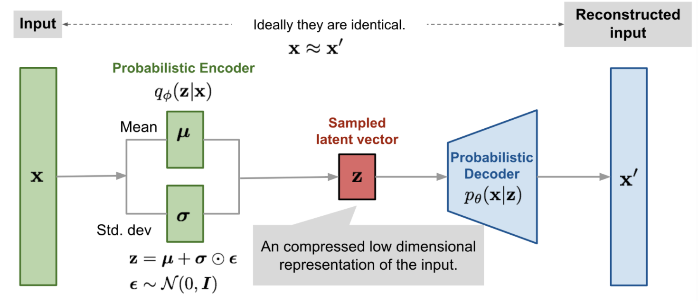
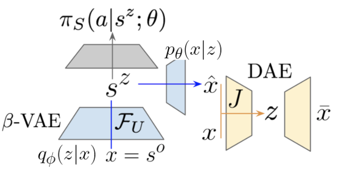
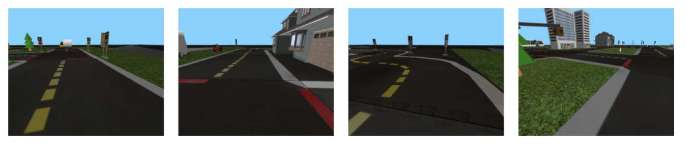

# Improving the RL baseline: Project report {#improving-rl-baseline-final-report status=ready}

In this project, we propose to improve the [Reinforcement Learning (RL) baseline](https://github.com/duckietown/docs-AIDO/blob/master19/book/AIDO/31_task_embodied_strategies/36_rl_baseline.md).

All of the work was done in collaboration between Étienne Boucher (@lifetheater57) and Mélisande Teng (@melisandeteng). You can find the slides for our mid-progress presentation [here](https://github.com/melisandeteng/challenge-aido_LF-baseline-RL-sim-pytorch/blob/DAE/slides.pdf).

## The final result {#improving-rl-baseline-final-result}

TODO: complete.
You should expect the agent to perform... in x context.

* TODO: VIDEO OF OUR AGENT - ideally video of episodes with the episode number displayed

TODO: A caption to the video.

You can find the [instructions to reproduce](#instructions-improving-rl-baseline) and the code is available on [Github](https://github.com/melisandeteng/challenge-aido_LF-baseline-RL-sim-pytorch/commits/darla).

## Mission and Scope {#improving-rl-baseline-final-scope}

The goal of this project is to improve the RL baseline in Duckietown by implementing a DARLA (DisentAngled Representation Learning Agent). At the end of the project, we hope to have done the implementation of the DARLA architecture and do some training of the agent in the simulator. 

### Motivation {#improving-rl-baseline-final-result-motivation}

So far, two main approaches have been explored to control duckiebots : classical robotics methods and pure RL approaches.

- **Classical robotics methods** work well when the state information from the camera feed is correct and can be interpreted in a meaningful way. However, they often require careful tuning of the parameters depending on the duckie / the environment (e.g. color range for line segments when the lighting conditions change) . 

- **RL approaches** allow the exploration of solutions that could not necessarily be found through classical methods or even imitating existing expert behavior, but they are often computationally expensive and data inefficient. In Duckietown, no pure RL approach seems to have outbeaten, or even matched the performance of classical methods.

The hope of a DARLA is that, by reducing the dimensionality of the input of the policy, it will outperform a pure RL agent and generalize better than the classical methods. In fact, the DARLA approach outbeats the pure RL agents over a range of popular RL algorithms (DQN, A3C and EC) and simulation environments (Jaco arm, DeepMind Lab). We expect it to work within the Duckietown environment.

### Existing solution {#improving-rl-baseline-final-literature}

The current RL baseline consists of a Deep Deterministic Policy Gradient (DDPG) agent . 
In Duckietown, the action space is consists of the wheel commands $v$ and $\omega$, and is continuous. 
DDPG is an off-policy algorithm, in which both an approximator to the optimal $Q$ function and an approximator to the optimal action function are learned. It can be thought of as Deep Q-learning .

We have access to the Duckietown simulator in a setup that allows the training of a RL agent. 

You can learn more about DDPG [here](https://spinningup.openai.com/en/latest/algorithms/ddpg.html).

### Opportunity {#improving-rl-baseline-final-opportunity}

The RL approaches explored so far were pure RL approaches.

After a day of training on a Nvidia RTX2060 mobile paired with an Intel i7-9750H and 16 GB of RAM, the agent of the RL baseline was going forward turning to the right straight out of lane independently of the configuration of the lane, and was still far from following the lane. 

Limitations of such pure RL models might include the lack of computing power since it is not possible to take advantage of the hardware acceleration on a computation cluster, or bad parameters initialization or reward function that didn’t foster convergence to a competent agent.

Moreover, the agent is trained in the Duckietown simulator, and there is no guarantee that transferring from sim to real will be successful with this approach.

#### Contribution{#improving-rl-baseline-final-opportunity-contribution}

We propose to implement and train a DARLA .  
There are three steps to follow: 

- **Learn to see**: solve the perception task. The goal is to learn a disentangled representation of the environment to be robust to domain shifts and more importantly to have a representation of the most important "concepts" present in the image that the RL agent will be able to use directly.

- **Learn to act**: train an RL agent.

- **Transfer**: evaluate on new target domain without retraining.

This approach is particularly interesting for Duckietown because of the domain shifts due to the variation of parameters in the simulator or the sim2real gap. Indeed, Higgins et al. argue that if a good disentangled representation of the environment is learned, the model can be transfered to new domains without further training. Instead of feeding the camera images directly to the RL model, we project it to a latent state space expressed in terms of factorised data generative factors and use this projection as the input for the RL agent training. The idea is that the latent features should be representative of the environment, and in this approach, not dependent on the details of the domain. 

## Background and Preliminaries {#improving-rl-baseline-final-preliminaries}

### Denoising Autoencoder (DAE)
An autoencoder is a neural network designed to learn an identity function in an unsupervised way. It consists of: 
- an encoder that compresses the input data into a latent lower-dimensional representation
- a decoder that reconstructs the original input data from the latent vector. 

DAEs are modified autoencoders where the input is partially corrupted by adding noise to or masking some values of the input vector in a stochastic manner to prevent the network from overfitting and thus to improve the robustness. 
<figure>
    <figcaption>DAE model ([ref](https://lilianweng.github.io/lil-log/2018/08/12/from-autoencoder-to-beta-vae.html)).</figcaption>
    
</figure>
### Variational Autoencoder (VAE)
In variational autoencoders, the encoder and decoder are probabilistic. Instead of mapping the input into a fixed vector, we parameterize the encoder and decoder distributions as gaussians and sample the latent vector from the encoder distribution.  
<figure>
    <figcaption>VAE with the multivariate Gaussian assumption ([ref](https://lilianweng.github.io/lil-log/2018/08/12/from-autoencoder-to-beta-vae.html)).</figcaption>
    
</figure>
The encoder learns to output two vectors $\mu$ and $\sigma$ which are the mean and variances for the latent vectors distribution. Then latent vector $\mathbf{z}$ corresponding to input $\mathbf{x}$  is obtained by sampling :
\[
    \mathbf{z}  = \mu + \sigma \epsilon
\]
where $\epsilon \sim \mathcal{N}(0,I)$

Then, the decoder reconstructs from the sampled latent vector.
### $\beta$-VAE

$\beta$-VAEs are a modification of VAEs to force the disentanglement of latent factors, meaning each variable in the latent representation only depends on one generative factor. 

For more details, we suggest you to refer to [this very good blogpost](https://lilianweng.github.io/lil-log/2018/08/12/from-autoencoder-to-beta-vae.html) from which the autoencoders drawings used in this section were taken.

### RL agent

In a RL framework, the goal is to maximize the expected cumulative reward following a policy. In Duckietown, the reward is defined with collistion avoidance and lane deviation penalties, as well as a function of speed and lane pose for a positive reward. 
In the Q-learning setting, an action-value function $Q$ estimates how good a certain action is, given a state, for an agent following a policy. The optimal Q-value function ($Q^*$) is such that the reward is maximized from a given state-action pair by any policy.
Finding the optimal policy corresponds to taking the best action as defined by $Q^*$ at each time step.

In deep Q-learning, a deep neural network is used to approximate the $Q$ function. 

For a DDPG algorithm, both the optimal Q function and the optimal action function are approximated. 

Have a look at the [RL section of the duckiebook](https://docs.duckietown.org/daffy/AIDO/out/embodied_rl.html). 
## Definition of the problem {#improving-rl-baseline-final-problem-def}

We follow the method proposed in  and train a perceptual model to learn a disentangled representation of the environment before training a RL agent on top of it. 
We assess the performance of our agent against the baseline in terms of number of episodes needed to solve the straight lane following task.
 
### Model architecture
<figure>
    <figcaption>DARLA architecture : in grey, the RL module;  in blue, the $\beta$-VAE perceptual module, in yellow, the auxiliary DAE to get targets on which to train the $\beta$-VAE. $\theta$ and $\phi$ parameterize the decoder and encoder of the $\beta$-VAE.</figcaption>
    
</figure>

#### Perceptual module
The perceptual module consists of a $\beta_{DAE}$-VAE . 
The output of the encoder $s$ is what is fed to the RL model. 
We train a $\beta$-VAE using targets in the feature space, obtained with a $DAE$
trained on the same set of images in a previous step. 

The objective function of the $\beta$-VAE is: 
\[
    \mathcal{L}(\theta, \phi, \mathbf{x},\mathbf{z}, \beta) = \mathbf{E}_{q_\phi(\mathbf{z}|\mathbf{x})}[\log p_\theta(\mathbf{x}|\mathbf{z})] - \beta D_{KL}(q_\phi(\mathbf{z}|\mathbf{x})||p(\mathbf{z})
\]
where $\theta, \phi$ are the parameters of the encoder and decoder resp.

In our setting, we write this function as: 
\[
    \mathbf{E}_{q_\phi(\mathbf{z}|\mathbf{x})}||J(\mathbf{\widehat{x}}) - J(\mathbf{x})||_2^2 - \beta D_{KL}(q_\phi(\mathbf{z}|\mathbf{x})||p(\mathbf{z})
\]
where $J$ corresponds to passing the imput image in the trained DAE up to a chosen layer. 

The first term corresponds to the perceptual similarity loss, while increasing $\beta$ in the second term encourages a more disentangled representation. 

Denoting $q_\phi(\mathbf{z}|\mathbf{x}) = \mathcal{N}(\mathbf{z} | \mu, \sigma)$ the encoder distribution, and given the latent prior $p(\mathbf{z}) = \mathcal{N}(), I)$, the KL divergence can be expressed as:
\[
  \dfrac{1}{2}\left ( \sum_{i} \mu_i^2 + \sigma_i^2 - (1 + \log \sigma_i^2) \right )  
\]
You can find the full derivation [here](https://arxiv.org/pdf/1907.08956.pdf).
#### RL agent
We use the DDPG agent of the baseline. 

## Contribution / Added functionality {#improving-rl-baseline-final-contribution}

### Dataset 

We created a custom map containing every object mesh and every type of tile available in the Duckietown simulator. Along with the map, we created a script to generate datasets. Then, we collected 6000 images in the Duckietown gym simulator, positioning and orienting the duckiebot randomly on the drivable tiles.

The dataset generation script has the following options available in addition to the options of the basic manual control script of the Duckietown gym:
- dataset-size : number of images to generate
- dataset-path : location to save the dataset
- compress : save the images as a series of png pictures rather than npy file(s)
- split : number of images per file (if used without --compress)

<figure>
    <figcaption>Dataset samples</figcaption>
    
</figure>

You can find instructions to collect the dataset in the [instructions](TODO: add link to instructions paragraph).

### DAE 
We first train the DAE for 2400 epochs, with learning rate 0.001 and adam optimizer. We choose the  
The input to the network are corrupted images from our simulated dataset by randomly masking a rectangular area, and we also add random color jittering transformations.
The network is trained on images of size 280 x 320 pixels. 

### Beta VAE

We train the $\beta$-VAE for XXX epochs, with learning rate XXX and XX optimizer, using images of size 280 x 320 pixels.
$\beta$ is chosen to be 1, so we actually have a VAE. 
- write something about the loss - 
We compute the perceptual similarity loss term using the outputs of our previously trained DAE as targets.

We also train a $\beta$-VAE with the original images as targets. 

### RL agent 

## Formal performance evaluation / Results {#improving-rl-baseline-final-formal}

### Denoising Auto Encoder

We train the DAE on our simulated images dataset for XXX epochs. 
something about the loss
[IMAGE of some RECONSTRUCTIONS]
_Be rigorous!_

### Beta Variational Auto Encoder

[IMAGE of traversals]

- For each of the tasks you defined in you problem formulation, provide quantitative results (i.e., the evaluation of the previously introduced performance metrics)
- Compare your results to the success targets. Explain successes or failures.
- Compare your results to the "state of the art" / previous implementation where relevant. Explain failure / success.
- Include an explanation / discussion of the results. Where things (as / better than / worst than) you expected? What were the biggest challenges?

## Future avenues of development {#improving-rl-baseline-final-next-steps}

_Is there something you think still needs to be done or could be improved? List it here, and be specific!_

Completing the search for an untangled representation and then try using it to train the RL agent.
Reward function

&lt;div id="./bibliography.bib"&gt;&lt;/div&gt;