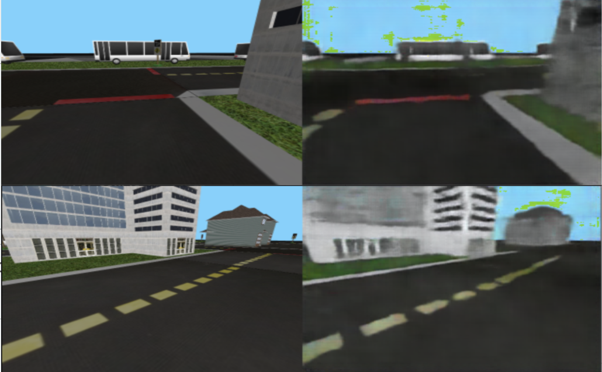

# Improving the RL baseline: Project report {#improving-rl-baseline-final-report status=ready}

In this project, we propose to improve the [Reinforcement Learning (RL) baseline](https://github.com/duckietown/docs-AIDO/blob/master19/book/AIDO/31_task_embodied_strategies/36_rl_baseline.md).

All of the work was done in collaboration between Étienne Boucher (@lifetheater57) and Mélisande Teng (@melisandeteng). You can find the slides for our mid-progress presentation [here](https://github.com/melisandeteng/challenge-aido_LF-baseline-RL-sim-pytorch/blob/DAE/slides.pdf).

## The final result {#improving-rl-baseline-final-result}

... Our initial goal was to compare an RL agent trained on top of a perceptual module with the current RL baseline. However we encountered some bottlenecks in the training of the perceptual model, and thus, offer a basis for work to be continued, rather than an improvement of the RL baseline ... 
Sorry if the title of the project deceived you ! But you can still read the report to learn more about a very interesting idea you might be able to successfully implement !

#TODO: check if we want to put anything here 
<figure>
    <figcaption>Samples of original image (left) and reconstruction by the DAE (right)</figcaption>
    
</figure>

You can find the [instructions to reproduce](#instructions-improving-rl-baseline) and the code is available on [Github](https://github.com/melisandeteng/challenge-aido_LF-baseline-RL-sim-pytorch/commits/darla).

## Mission and Scope {#improving-rl-baseline-final-scope}

The goal of this project was to improve the RL baseline in Duckietown by implementing a DARLA (DisentAngled Representation Learning Agent). At the end of the project, we hoped to have done the implementation of the DARLA architecture and some training of the agent in the simulator. 

### Motivation {#improving-rl-baseline-final-result-motivation}

So far, two main approaches have been explored to control Duckiebots : classical robotics methods and pure RL approaches.

- **Classical robotics methods** work well when the state information from the camera feed is correct and can be interpreted in a meaningful way. However, they often require careful tuning of the parameters depending on the duckie / the environment (e.g. color range for line segments when the lighting conditions change) . 

- **RL approaches** allow the exploration of solutions that could not necessarily be found through classical methods or even imitating existing expert behavior, but they are often computationally expensive and data inefficient. In Duckietown, no pure RL approach seems to have outbeaten, or even matched the performance of classical methods.

The hope of a DARLA is that, by reducing the dimensionality of the input of the policy, it will outperform a pure RL agent and generalize better than the classical methods. In fact, the DARLA approach outbeats the pure RL agents over a range of popular RL algorithms (DQN, A3C and EC) and simulation environments (Jaco arm, DeepMind Lab). We expect it to work within the Duckietown environment.

### Existing solution {#improving-rl-baseline-final-literature}

The current RL baseline consists of a Deep Deterministic Policy Gradient (DDPG) agent . 
In Duckietown, the action space is consists of the wheel commands $v$ and $\omega$, and is continuous. 
DDPG is an off-policy algorithm, in which both an approximator to the optimal $Q$ function and an approximator to the optimal action function are learned. It can be thought of as Deep Q-learning .

We have access to the Duckietown simulator in a setup that allows the training of a RL agent. 

You can learn more about DDPG [here](https://spinningup.openai.com/en/latest/algorithms/ddpg.html).

### Opportunity {#improving-rl-baseline-final-opportunity}

The RL approaches explored so far were pure RL approaches.

After a day of training on a Nvidia RTX2060 mobile paired with an Intel i7-9750H and 16 GB of RAM, the agent of the RL baseline was going forward turning to the right straight out of lane independently of the configuration of the lane, and was still far from following the lane. 

Limitations of such pure RL models might include the lack of computing power since it is not possible to take advantage of the hardware acceleration on a computation cluster, or bad parameters initialization or reward function that didn’t foster convergence to a competent agent.

Moreover, the agent is trained in the Duckietown simulator, and there is no guarantee that transferring from sim to real will be successful with this approach.

#### Contribution {#improving-rl-baseline-final-opportunity-contribution}

To adress these issues, we implemented a DARLA .

There are three steps to follow to train a DARLA: 

- **Learn to see**: solve the perception task. The goal is to learn a disentangled representation of the environment to be robust to domain shifts and more importantly to have a representation of the most important "concepts" present in the image that the RL agent will be able to use directly.

- **Learn to act**: train an RL agent.

- **Transfer**: evaluate on new target domain without retraining.

We achieved to implement a DARLA and produce the infrastructure required to explore different designs of the perception model. Doing so, we set the basis for future work to find the right perception configuration in the context of Duckietown.

The DARLA approach is particularly interesting for Duckietown because of the domain shifts due to the variation of parameters in the simulator or the sim2real gap. Indeed, Higgins et al. argue that if a good disentangled representation of the environment is learned, the model can be transfered to new domains without further training. Instead of feeding the camera images directly to the RL model, we project it to a latent state space expressed in terms of factorised data generative factors and use this projection as the input for the RL agent training. The idea is that the latent features should be representative of the meaningful component of the environment, and not dependent on the details of the domain.

## Background and Preliminaries {#improving-rl-baseline-final-preliminaries}

Different neural network models are proposed to be used jointly within the DARLA training. They are the Denoising Autoencoder (DAE), $\beta$ Variational Autoencoder ($\beta$-VAE) and a deep RL agent.

### Denoising Autoencoder (DAE)

An autoencoder is a neural network designed to learn an identity function in an unsupervised way. It consists of two parts.

- An encoder that compresses the input data into a latent lower-dimensional representation
- A decoder that reconstructs the original input data from the latent vector. 

DAEs are modified autoencoders where the input is partially corrupted by adding noise to or masking some values of the input vector in a stochastic manner to prevent the network from overfitting and thus to improve the robustness. 
<figure>
    <figcaption>DAE model ([ref](https://lilianweng.github.io/lil-log/2018/08/12/from-autoencoder-to-beta-vae.html)).</figcaption>
    
</figure>
### Variational Autoencoder (VAE)
In variational autoencoders, the encoder and decoder are probabilistic. Instead of mapping the input into a fixed vector, we parameterize the encoder and decoder distributions as gaussians and sample the latent vector from the encoder distribution.  
<figure>
    <figcaption>VAE with the multivariate Gaussian assumption ([ref](https://lilianweng.github.io/lil-log/2018/08/12/from-autoencoder-to-beta-vae.html)).</figcaption>
    
</figure>
The encoder learns to output two vectors $\mu$ and $\sigma$ which are the mean and variances for the latent vectors distribution. Then latent vector $\mathbf{z}$ corresponding to input $\mathbf{x}$  is obtained by sampling :
\[
    \mathbf{z}  = \mu + \sigma \epsilon
\]
where $\epsilon \sim \mathcal{N}(0,I)$

Then, the decoder reconstructs the input from the sampled latent vector.

### $\beta$-VAE

$\beta$-VAEs add a modulation factor to the VAEs to force the disentanglement of latent variables, meaning each variable in the latent representation only depends on one generative factor. 

For more details, we suggest you to refer to [this very good blogpost](https://lilianweng.github.io/lil-log/2018/08/12/from-autoencoder-to-beta-vae.html) from which the autoencoders drawings used in this section were taken.

### RL agent

In a RL framework, the goal is to maximize the expected cumulative reward following a policy. In Duckietown, the reward is defined with collistion avoidance and lane deviation penalties, as well as a function of speed and lane pose for a positive reward. 
In the Q-learning setting, an action-value function $Q$ estimates how good a certain action is, given a state, for an agent following a policy. The optimal Q-value function ($Q^*$) is such that the reward is maximized from a given state-action pair by any policy.
Finding the optimal policy corresponds to taking the best action as defined by $Q^*$ at each time step.

In deep Q-learning, a deep neural network is used to approximate the $Q$ function. 

For a DDPG algorithm, both the optimal Q function and the optimal action function are approximated. 

Have a look at the [RL section of the duckiebook](https://docs.duckietown.org/daffy/AIDO/out/embodied_rl.html). 

## Definition of the problem {#improving-rl-baseline-final-problem-def}

We follow the method proposed in the original DARLA paper  and train a perceptual model to learn a disentangled representation of the environment before training a RL agent on top of it.
 
### Model architecture

<figure>
    <figcaption>DARLA architecture : in grey, the RL module;  in blue, the $\beta$-VAE perceptual module, in yellow, the auxiliary DAE to get targets on which to train the $\beta$-VAE. $\theta$ and $\phi$ parameterize the decoder and encoder of the $\beta$-VAE.</figcaption>
    
</figure>

#### Perceptual module

The perceptual module consists of a $\beta-VAE_{DAE}$ . 
The output of the encoder $s^z$ is what is fed to the RL model. 
We train a $\beta-VAE$ using targets in the feature space, obtained with a $DAE$
trained on the same set of images in a previous step. 

The objective function of the $\beta$-VAE is: 

\[
    \mathcal{L}(\theta, \phi, \mathbf{x},\mathbf{z}, \beta) = \mathbf{E}_{q_\phi(\mathbf{z}|\mathbf{x})}[\log p_\theta(\mathbf{x}|\mathbf{z})] - \beta D_{KL}(q_\phi(\mathbf{z}|\mathbf{x})||p(\mathbf{z})
\]

where $\theta, \phi$ are the parameters of the encoder and decoder respectively.

In our setting, we write this function as: 

\[
    \mathbf{E}_{q_\phi(\mathbf{z}|\mathbf{x})}||J(\mathbf{\widehat{x}}) - J(\mathbf{x})||_2^2 - \beta D_{KL}(q_\phi(\mathbf{z}|\mathbf{x})||p(\mathbf{z})
\]

where $J$ corresponds to passing the imput image in the trained DAE up to a chosen layer. 

The first term corresponds to the perceptual similarity loss, while increasing $\beta$ in the second term encourages a more disentangled representation. 

Denoting $q_\phi(\mathbf{z}|\mathbf{x}) = \mathcal{N}(\mathbf{z} | \mu, \sigma)$ the encoder distribution, and given the latent prior $p(\mathbf{z}) = \mathcal{N}(0, I)$, the KL divergence can be expressed as:

\[
  \dfrac{1}{2}\left ( \sum_{i} \mu_i^2 + \sigma_i^2 - (1 + \log \sigma_i^2) \right )  
\]

You can find the full derivation [here](https://arxiv.org/pdf/1907.08956.pdf).

#### RL agent

The DDPG agent of the baseline is used both for time constraints and allowing a direct comparison with the original pure RL agent. 

### Performance assessment

We assess the performance of our agent against the baseline in terms of number of episodes needed to solve the straight lane following task. More precisely, the process will be as follow.

1. We train the perceptual model of the DARLA, then we train its RL agent until it is able to follow the lane in the `straight_road` map of the gym Duckietown. Then, we set up a straight line in a real life tiles and run the DARLA on a Duckiebot and monitor both the distance travelled along the road and its distance to the center of the lane.

2. We train the pure RL agent for the same duration that the DARLA was and we check if it can follow the lane in the `straight_road` map. If it does, we do the test and measurements on the real straight line.

3. No matter the previous results with the pure RL agent, we continue its training for the duration of the training of the perceptual model of the DARLA and then follow the same procedure as in 2.

If the pure RL agent in 2 fails to follow the straight road in the simulator, then the DARLA agent did improve over the pure RL agent in term of data efficiency for the RL part of the training.

If the pure RL agent in 3 fails to follow the straight road in the simulator, then we can approximately conclude that the DARLA agent did improve over the pure RL agent in term of data efficiency for the overall training, including the training of its perception model.

For both training steps of the pure RL agent, if the DARLA stays in lane over a greater distance, or if the mean of its distance to the center of the lane is inferior to that of the pure RL (in the case when both succeed to get to the end), then it will have improved its performance over the pure RL agent in domain adaptation. 

If DARLA beats the pure RL agent in 3, then it would have beaten the pure RL method in domain adaptation even with overall the same training time. But if it only beats the pure RL agent in 2, then we would conclude it has improved the domain adaptation for equivalent RL training time.

## Contribution / Added functionality {#improving-rl-baseline-final-contribution}

Overall, this can be divided into two main sections, the dataset generation and the perception model training.

For the training of the perception model, we approximately used the following protocol:

1. Train the DAE until the loss stabilizes.
2. Check that images are really reconstructed by the DAE. If they are, go to step 3. Otherwise, increase the network complexity and go to step 1.
3. Train the $beta$-VAE until the loss stabilizes.
4. Check that images are really reconstructed by the VAE. If they are, go to step 5. Otherwise, increase the network complexity and go to step 3. If, after increasing the network complexity, increase the latent space dimension. After increasing the latent space dimension, if there is no significant improvement in image reconstruction, try reducing $beta$.
5. Visualize the traversals and check whether each dimension represent a specific generative factor. If not, increase $beta$ or decrease the number of dimensions in the latent space depending on what has been done in 4 and go to step 3.

For all the training sessions of both the DAE and $beta$-VAE, the images were resized to 240 x 320 pixels. The images were corrupted at runtime by randomly masking a rectangular area and applying a random color jittering transformation.

### Dataset 

We created a custom map containing every object mesh and every type of tile available in the Duckietown simulator. Along with the map, we created a script to generate datasets. Then, we collected 6000 images in the Duckietown gym simulator, positioning and orienting the Duckiebot randomly on the drivable tiles.

The dataset generation script has the following options available in addition to the options of the basic manual control script of the Duckietown gym:

Option | Description
--- | ---
`dataset-size` | number of images to generate
`dataset-path` | location to save the dataset
`compress` | save the images as a series of png pictures rather than npy file(s)
`split` | number of images per file (if used without --compress)

<figure>
    <figcaption>Dataset samples</figcaption>
    
</figure>

You can find instructions to collect the dataset in the [instructions](#demo-improving-rl-baseline-run).

### Neural network architectures

Unless mentioned otherwise, the neural network architectures used were the ones described in the appendix A.3.1 and A.3.2 of the DARLA article  almost as is.

For the DAE, the encoder was composed of four convolution layers with 32, 32, 64, 64 filters respectively. They all have a kernel size of 4 and a stride of 2. The encoder was bottlenecked by a fully connected of 128 neurons. Finally, the decoder on top of the dense layer was composed of 4 transposed convolution layers also all with kernel size of 4 and stride of 2 and with number of filters of 64, 64, 32, 32 respectively. ReLu non linearity was used after the convolution layers of the decoder and before the transposed convolution layers of the decoder.

The encoder of the $beta$-VAE was the same as the one of the DAE, but with a dense layer of 256 neurons on top of it. Then, the latent layer had 64 neurons parametrizing 32 gaussians. The decoder was the reverse of the encoder but using transposed convolution layers instead. Also, the last layer has 6 channels in output instead of 3 like the input. To get the image in output, a value was sampled from the the 3 gaussians parametrised by the 6 channels.

### Training sessions

For all our DAE training sessions, the learning rate was `0.001` and the optimizer was `adam`. 

The first few training sessions were training both the DAE and the $beta$-VAE (learning rate of `0.0001` and `adam` optimizer). The figure below show the kind of result we got after those trainings.

<figure>
    <figcaption>Reconstruction of the image by the VAE after training over 450 epochs with a learning rate of `0.0001` and `adam` optimizer. On the left, we can see the original image. On the right is the image generated by the $beta$-VAE.</figcaption>
    
</figure>

The fact that the colors were really out of the expected range, brought us to question the value of the color normalization that was made in the data loader. So, we tried to remove that normalization from the loader. From one training session, we got great reconstruction result from the DAE as we can see in the figures below.

<figure>
    <figcaption>Reconstruction of the image by the DAE after training over 300 epochs with a learning rate of `0.001` and `adam` optimizer. On the left, we can see the original image. On the right is the image generated by the DAE.</figcaption>
    
</figure>

<figure>
    <figcaption>Reconstruction of the image by the DAE after training over 600 epochs with a learning rate of `0.001` and `adam` optimizer. On the left, we can see the original image. On the right is the image generated by the DAE.</figcaption>
    
</figure>

<figure>
    <figcaption>Reconstruction of the image by the DAE after training over 1200 epochs with a learning rate of `0.001` and `adam` optimizer. On the left, we can see the original image. On the right is the image generated by the DAE.</figcaption>
    
</figure>

<figure>
    <figcaption>Reconstruction of the image by the DAE after training over 2400 epochs with a learning rate of `0.001` and `adam` optimizer. On the left, we can see the original image. On the right is the image generated by the DAE.</figcaption>
    
</figure>

We can see great reconstruction of the images for that run. However, with another run over 1550 epoch in the same setting, the precision of the reconstruction became sharp, but it didn't become in color. But, having a well trained DAE, we used it to train the $beta$-VAE.

<figure>
    <figcaption>Reconstruction of the image by the DAE after training over 2400 epochs with a learning rate of `0.001` and `adam` optimizer and by the $beta$-VAE after training over 900 epochs with a learning rate of `0.0001` and `adam` optimizer using the DAE for the loss. 
Top left: original image, Top right: DAE reconstruction of the original image, Bottom left: VAE reconstruction of the original image, Bottom right: DAE reconstruction of the VAE reconstruction of the original image. </figcaption>
    
</figure>

There are several parameters we considered and varied for the $\beta$-VAE training: 
- Data :
    - adding domain randomized images in the training data set
    - masking randomly a rectangular area in the input images ( as in the DAE )
    - input normalization
    - input size
- Architecture:
    - Removing gaussian sampling at the end of the VAE decoder
    - Adding a dense ReLU layer at the end of the VAE decoder
- Target:
    - DAE output target or original image 
- Hyperparameters:
    - $\beta$
    - learning rate
    - latent dimension

#TODO: add conclusions about the various runs
 2_run_450_epochs_normalized
 3_run_600_epochs_normalized
'4-5_[DAE]_run_600_and_1550_epochs_noNorm'
'6_[VAE]_run_600_epochs_noNorm'
'7_[VAE]_run_900_epoch_no_Norm_from_2400_dae'
'8-13_[VAE]_run_1200_and_2600_epoch_dense_ReLu'
'9_[VAE]_run_250_epoch_no_dae'
'10_[VAE]_run_250_epoch_no_dae_dom_rand'
'11_[VAE]_run_500_epoch_no_dae_dom_rand_rand_mask'
'12_[VAE]_run_500_epoch_no_dae_dom_rand_rand_mask_lr_0_001'
'14_[VAE]_run_350_epoch_dense_ReLu_no_Gauss_output'
'15_[VAE]_run_200_epoch_dense_ReLu_no_Gauss_output_no_dae'
'16_[VAE]_from_15_run_50_epoch_move_ReLu_after_conv_trans'
'17_[VAE]_from_16_run_50_epoch_increase_filter_nb_batch_norm'
'18_[VAE]_from_17_run_50_epoch_increase_filter_nb_batch_norm'
'19_[VAE]_from_18_run_1200_epoch_increase_latent_dim_to_128'
'20_[VAE]_from_19_run_100_epoch_beta_0'
'21_[VAE]_from_20_run_200_epoch_beta_0_5_from_20'
'22_[VAE]_from_21_run_100_epoch_beta_4_lr_0.0005_no_dense'
'23_[VAE]_from_22_run_100_epoch_beta_4_lr_0.0005_with_dense'

We also tried training a VAE with smaller input size (64 * 64) with standard VAE loss as in , and latent dimension 10. We followed [this](https://github.com/YannDubs/disentangling-vae) implementation.
The model was able to roughly reconstruct some lines but still output grayscale like images. 

<figure>
    <figcaption>Samples of inputs and the VAE for  64*64 input size outputs </figcaption>
    
</figure>

Leaving the colorjittering transformations out of the data processing with the same model, we were able to produce color reconstructions. We did not push the training of this model too far as we then wanted to try the same setting on larger input images. However, we might want to revert to a smaller inputs setting in future experiments. 

<figure>
    <figcaption>Samples of inputs and the VAE for  64*64 input size outputs without color jittering after 5 epochs</figcaption>
    
</figure>

These experiments might hint that the normalization of input images should be checked, or we should investigate further the impact of the size of the input.

## Formal performance evaluation / Results {#improving-rl-baseline-final-formal}
### DAE

<figure>
    <figcaption>Samples of original image (left) and reconstruction by the DAE (right) after training over 2400 epochs with a learning rate of `0.001` and `adam` optimizer</figcaption>
    
</figure>

If we look at the loss function of the DAE during the training, we can see a first plateau around 200-280 epochs, and then a drop in the loss (see figure below). 
Looking at the DAE reconstructions along the training, we notice that before the drop, the reconstruction seems to be grayscale, while after the drop, we can see a color reconstruction (see figures of the previous section). 

<figure>
    <figcaption>Loss of the DAE after training over 1200 epochs with a learning rate of `0.001` and `adam` optimizer.</figcaption>
    
</figure>

### Beta Variational Auto Encoder

### Overall results 
While the DAE gave satisfactory results, we were not able to obtain a good beta-VAE model. Even after trying different strategies including smarter weight initialisation, increasing the number of filter and the dimension of the latent space, we couldn't get anything else than the grey sky with uniform dark ground. There might be some more parameter tuning to be done to be able to reconstruct colors and details. 
Nonetheless, the runs on smaller images might hint that it might be worth trying to develop a model first on smaller images.

We didn't get to trying to train the RL part of DARLA, so we did not get to assess the performance of our model following the process outlined exposed earlier. 
Instead, we have set the basis and infrastructure for future work in that direction.

## Future avenues of development {#improving-rl-baseline-final-next-steps}

The first step would be to complete the search for an untangled representation and then try using it to train the RL agent.
One way to go would be to start with a model taking 64*64 images as it seemed like the most promising run of VAE, and then,
depending on the performance of the agent, it could also be interesting to investigate reward shaping and other RL learning techniques like Rainbow DQN, TD3, and SAC.

