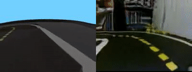
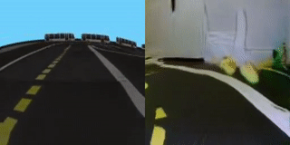
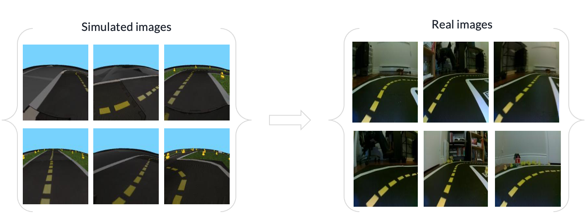
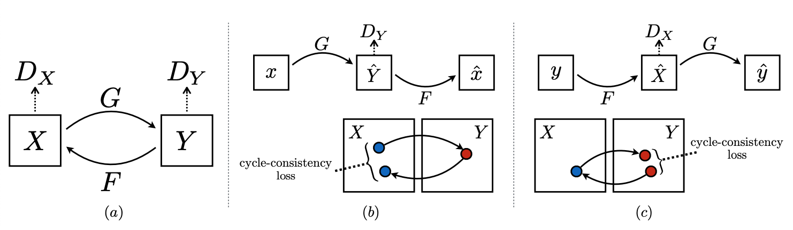
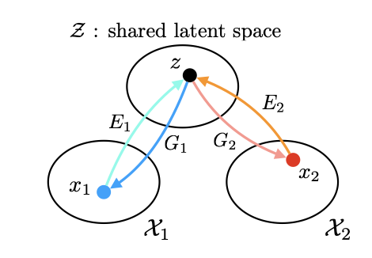
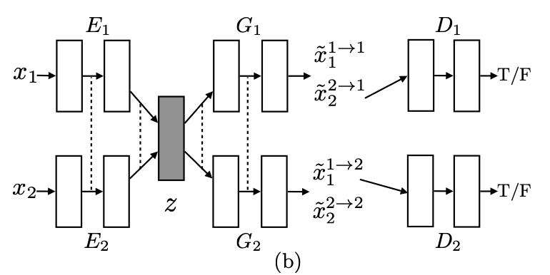

#  Sim2real: Project report {#sim2real-final-report status=ready}

Before starting, you should have a look at some tips on [how to write beautiful Duckiebook pages](+duckumentation#book).

<!--
General notes:
- REMEMBER to change:
- "groupname" in the chapter labels to your group label (e.g. proj-xyz) - not doing this will cause the build to crash.
- "group name" every where you read it to a string describing your project; e.g., parking, self-calibration, learning to follow the lane, etc.
-->

_The objective of this report is to bring justice to your  hard work during the semester and make so that future generations of Duckietown students may take full advantage of it. Some of the sections of this report are repetitions from the preliminary design document (PDD) and intermediate report you have given._

## The final result {#sim2real-final-result}

_Let's start from a teaser._

The two folowing videos represent our best results. To reproduce, please refer to the [instructions to reproduce](#instructions-sim2real).

<figure align="center">
    <figcaption>UNIT sim2real generation</figcaption>
    
</figure>

For UNIT, please read this [README.md](https://github.com/phred1/imaginaire)

<figure align="center">
    <figcaption>CycleGAN sim2real generation</figcaption>
    
</figure>

For CycleGAN, please read this [README.md](NOTEBOOK of Mo)

## Mission and Scope {#sim2real-final-scope}

_Now tell your story:_

The mission of this project was to find a way to close the reality gap by using Generative Adversarial Networks 
and other deep learning techniques to generate realistic images from simulation images. The idea is that by 
replacing the simulated image by a realistic image with the same general features of the simulated image, we could train an agent in the simulator that would not have to be tuned seperately on the simulator and on the robot.
We have two major goals that we want to attain with this attempt:

- Train a model to generate realistic images from simulation images.
- Mitigate the need for color threshold calibration when going from the simulator to the real world

### Motivation {#sim2real-final-result-motivation}

_Now step back and tell us how you got to that mission._

- What are we talking about? [Brief introduction / problem in general terms]

There exists a discrepancy between the simulation environment and the real environment that considerably reduces the performance of the robot in the real environment after being trained in simulation. This dsicrepancy if often referred to as the reality gap. Even though there are multiple factors causing this reality gap, visual perception is often the most influential component since synthetic images - images coming from simulation - do not constitute a realistic representation of the real world. They mislead the trained models in learning specific features without generalizing well. Instead of investing in extensive resources to develop a new, more realistic yet not realistic enough simulator, we propose to leverage the benefits of GAN to generate realistic images from simulated images.

- Why is it important? [Relevance]

Training a robot in a simulated environment has many advantages: simulators are easier to use and control than the real environment and have the advantage of allowing reproducibility. However, this comes with a major drawback which is the complex transition from the simulated world to the real world. Successfully closing that gap could greatly improve autonomous vehicule research as it would allows for faster and less costly experimentations. For example, if we could be certain that an agent trained on a simulator would behave very similarly in real life, this could significantly reduce the cost of training compared to having to train an agent in the real world with real cars and potentially affecting real people. 

### Existing solution {#sim2real-final-literature}

-  Describe the "prior work"
#### Domain Randomization 
Domain randomization tries to mitigate the effect of training an agent in a simulator by randomly modifying the colors, lighting, material textures, noise, camera orientation, etc. of the images seen in the simulator. This is done in the hope that the resulting agent will be able to learn only the features that are common to all the randomized images and therefore provide a more robust agent that should generalize well and perform well in the real world.

### Opportunity {#sim2real-final-opportunity}

* What was wrong with the baseline / prior work / existing solution? Why did it need improvement?

Examples:
- there wasn't a previous implementation
- the previous performance, evaluated according to some specific metrics, was not satisfactory
- it was not robust / reliable
- somebody told me to do so (/s) (this is a terrible motivation. In general, never ever ever say "somebody told me to do it" or "everybody does like this")

* How did you go about improving the existing solution / approaching the problem? [contribution]
(How did we approach the problem?)

Our first approach was to try to use style transfer techniques to learn realistic featrues from a single real image and apply them to a dataset of simulated images. Our second approach relied on unsupervised image-to-image translations, where two unpaired datasets are provided, with one consisting of real data and the second one of simulated data. We tried two types of GANs architecture specifically adapted to domain adaptation: CycleGan and UNsupervised Image-to-image Translation Networks (UNIT). CycleGan uses (Mo Explanation ... ). UNIT build upon CycleGans work and and what the authors refer to as the notion of shared latent space between images from two domains. 
### Style Transfer

### CycleGan
CycleGAN consists in learning a translation between a source domain X and a target domain Y in the absence of paired examples. We learn a mapping G : X -> Y such that the generated images G(X) follow a distribution that is, theoretically, identical to the target's domain distribution, Y. This is done using an adversarial loss. However, considering the under-constrained nature of the translation mapping, cycleGAN couples the adversarial loss with a cycle consistency loss by using the bijective inverse mapping F: Y -> X which enforces the fact that applying F to the mapping G(X) should return the original X (and vice-versa).

### Nvidia UNIT 
UNIT attempts to learn the same mapping G : X -> Y as CycleGAN, but it uses a slightly different approach, by enforcing the idea of a shared latent space between pairs of images and using Variational Auto Encoder (VAE) in addition to a GAN network. Thus, UNIT tries to minimize the cycle consistency loss, the VAE loss as well as the adversarial loss.

## Background and Preliminaries {#sim2real-final-preliminaries}

* Is there some particular theorem / "mathy" thing you require your readers to know before delving in the actual problem? Briefly explain it and links for more detailed explanations here.

Definition of link:
- could be the reference to a paper / textbook
- (bonus points) it is best if it is a link to Duckiebook chapter (in the dedicated "Preliminaries" section)

## Definition of the problem {#sim2real-final-problem-def}

_Up to now it was all fun and giggles. This is the most important part of your report: a crisp, possibly mathematical, definition of the problem you tackled. You can use part of the preliminary design document to fill this section._

Make sure you include your:
- final objective / goal
- assumptions made
- quantitative performance metrics to judge the achievement of the goal

Domain Adaptation in the realm of images corresponds to the image-to-image translation problem. This task at hand hre is learning the joint distribution between to domain of images that allows to transition from one domain to the other. When using a supervised approach, it implies that we have a dataset consiting of corresponding pairs of images in each domains. If this data is available, then the problem is limited to finding a joint distribution Px1.x2(x1,x2) from a samples (x1,x2), which is relatively easy to do. However, when using the unsupervised image-to-image translation approach, where the dataset consists of simply one datasets from each domain with no pairing of images, the task becomes harder. Indeed, with the unsupervised approach, the samples that are used are drawn from the marginal distributions PX1(x1) and PX2(x2). Therefore, the task is now to find the joint distribution between those two marginal distributions that would allow to translate from one domain to the other. The problem with that task is that there exist an infinity of possible joint distributions that could yield the marginal distributions. The goal is to find an approach to find the joint distribution that can accomplish the image-to-image translation task properly. To successfully reach this goal, different assumptions are made with each different model implementation we made. The next section will detail those assumption and implementation details. 

## Contribution / Added functionality {#sim2real-final-contribution}

Describe here, in technical detail, what you have done. Make sure you include:
- a theoretical description of the algorithm(s) you implemented
- logical architecture
- software architecture
- details on the actual implementation where relevant (how does the implementation differ from the theory?)
- any infrastructure you had to develop in order to implement your algorithm
- If you have collected a number of logs, add link to where you stored them

_Feel free to create subsections when useful to ease the flow_
### Style Tranfer
#### Theory
#### Implementation

###Unpaired image-to-image translation
As mentioned earlier, our goal is to refine simulated images - resulting images from training in simulation - in order to make them look more realistic. Completing the training using paired images is an impossible task considering the size of our datasets (~30000 images) which is why we turn towards models that will allow to learn a mapping between an input domain and a target domain. In order to do so, we will have two separate collections of images, one for the simulated images and one for the real images. The models we discuss below will aim at capturing the specific characteristics of one image collection and figure out how these characteristics could be translated to the other image collection, without having to pair them. The figure below shows a subset of the two collections we need before training our models.

<figure align="center">
    <figcaption>Dataset collections for simulated and real images</figcaption>
    
</figure>

### CycleGAN
#### Theory
One of the fundamental assumptions of cycleGAN is that there exists an underlying relationship between the two domains we are trying to learn a mapping for. For example, in our case, we assume that the environment in simulation and in reality are the same but only differ in their rendering. However, as we will see, this assumption is not fully verfied for us in the sense that the environments in simulation and reality are not the same. Keping this in mind, we can still exploit the capabilities of cycleGAN. As mentioned earlier, there are no paired examples in our dataset which makes our learning process unsupervised. Nonetheless, supervision is still exploited at the level of sets as we have two separate collections of images in a certain domain, X and Y. Indeed, the mapping G, defined earlier, translates the domain X to a domain Y' that is identically distributed to Y. However, there could be infinitely many mappings G that could induce the same distribution over y' for a specific input x. The adversarial loss is thus difficult to optimize and lead to the problem of mode collapse: all input images map to the same output image. This explains the under-constrained nature of the GAN whic is why we enforce a cycle-consistency loss.

<figure align="center">
    <figcaption>CycleGAN Learning</figcaption>
    
</figure>

As shown in part a) of the figure above, we apply an adversarial loss to both mappings G: X -> Y and F: Y -> X. $D_{Y}$ and $D_{X}$ are the associated discriminators for each mapping G and G respectively. As an example, $D_{Y}$ encourages G to generate images G(X) that are indistinguishable from the target domain Y. This can be seen as a "game" where G minimizes the loss and D maximizes it. The adversarial loss, for mapping G, can be described as follows:

                                Lgan(G, Dy, X, Y) = E[log(Dy(y))] + E[log(1 - Dy(G(X)))]

The adversarial loss for mapping F is defined similarly.

Parts b) and c) of the figure above depict whart we defined as the cycle consistency loss. This loss tries to capture the intuition that if we translate from one domain X to domain Y and back to domain X, we should get back to the position from which we originally started. Part a shows the forward cycle-consistency and c) the backwards cycle-consistency. This loss can be described as follows: 

                                Lcyc(G,F) = E[||F(G(x)) - x||] + E[||G(F(y))-y||]

#### Implementation

### UNIT
#### Theory
To address the infinite possible joint distributions issue, the UNIT authors make multiple assumptions to facilitate the search of the desired joint distribution.  
The first assumption is denoted as the shared latent space assumptions. The author assume that there exists a shared latent space for any pair of images that can be obtained from the images, and from which both images could be recovered. Formally, they suggest the following formulation: 
<figure align="center">
    <figcaption>Shared Latent Space</figcaption>
    
</figure>
The relationship expressed in the figure can be describe with equations \eqref{eq:shared-latent-space}. Basically, there exist a function that can map from a domain X to latent space z and from z to the domain X.

\begin{equation}
    z= E_1 (x_1) =  E_2 (x_2)  \label{eq:shared-latent-space}
    \newline
    x_1= G_1 (z) 
    \newline
    x_2 = G_2 (z) 
\end{equation}

Moreover, the authors suggest that there is a way to translate from one domain to the other by using a composition of the proposed functions. Equations \eqref{eq:from-d1-to-d2} demonstrate how such transition can be made.
\begin{equation}
    x_2 = F_{12} (x_1)  \label{eq:from-d1-to-d2}
    \newline
    F_{12} (x_1) = G_2 (E_1 (x_1))
\end{equation}

The problem to solve then resolves aroung the finding the fonctions F_12 and F_21. It it interesting to mention that for those two function to exist, it implies that the cycle consistency, represented by equation \eqref{eq:cycle-consistency} also exists. This ties the shared latent space assumption of UNIT to the findings of CycleGAN.

\begin{equation}
    x_1 = F_{21} (x_2) = G_1 (E_2  (x_2)) \label{eq:cycle-consistency}
\end{equation}

#### Implementation

<figure align="center">
    <figcaption>UNIT architecture</figcaption>
    
</figure>
The above figure demonstrates the UNIT architecture. The Network is composed of 6 subnetworks input images. There are two encoders, two generators and two discriminator per network images. The encoder-generator combination makes it a variational auto-encoder (VAE) architecture combined with a discriminator, which tries to discern from real and generated images. To enforce the learning of the shared latent space z, the model enforces weight sharing between the last two layers of both input encoders, and the first few layers of the generators. That shared latent space is what allows the system to perform domain adaptation of images. For example, if the need is to translate an image x1 from domain X1 to domain X2, we can simply feed the image to encoders E1 followed by the generator G2. This pipeline represents the function F12 mentionned in equation \eqref{eq:from-d1-to-d2}.
Finally, during training of the networks, the goal is to minimize the VAE losses and the Cycle Consistency losses, as well as the adversarial loss between the Disciminators and the generators. 

### DuckieTown Integration
To integrate our model to the duckietown stack and test its performance on the actual robot, we had to create a new ROS node specifically for the task.

This ROS node acts as a proxy between the camera node publishing the compressed image topic and all the other nodes subscribing to that topic. Therefore, all other nodes are now using the generated realistic image instead of a simulated image.  

## Formal performance evaluation / Results {#sim2real-final-formal}

_Be rigorous!_

- For each of the tasks you defined in you problem formulation, provide quantitative results (i.e., the evaluation of the previously introduced performance metrics)
- Compare your results to the success targets. Explain successes or failures.
- Compare your results to the "state of the art" / previous implementation where relevant. Explain failure / success.
- Include an explanation / discussion of the results. Where things (as / better than / worst than) you expected? What were the biggest challenges?

### Realistic Image generation: 

#### Style Transfer
- **Succes**:

- Failure:
    - what features where properly extracted, which were not?

#### CycleGan
- **Succes**:

- Failure:
    - mode collapse? 

#### UNIT

Results: [Full video](https://youtu.be/iXRV7G1GGFo)

<figure align="center">
    <figcaption>UNIT sim2real generation</figcaption>
    
</figure>

- **Success**:

    The UNIT model was able to learn a generative model that could generate quite realistic images from synthetic images. A sample of the results can be seen in the above gif and more in the linked video. We can clearly see that UNIT is able to extract the main defining features of a simulation image and translate it to the real world. Indeed, left turn and right turns are properly translated, which was one of the crucial thing the model had to learn. Also, the color and textures of the road are very well translated. Finally, the UNIT model seem to not have been affected as much as CycleGAN by mode collapse.

- **Failures**:

    UNIT struggled to generate realistic images from simulation images when the simulated image had features not seen in the real dataset. For example, the simulator dataset sometimes had long straing lines which had no equivalent in the real dataset. To represent this long straight line with realistic image, the model chose to simply append identical short line images, which produces a weird effect not representative of reality. 

    However, those find of issues could probaly have been solved by using a better dataset. Indeed, the real data we used was comming from the same unique environment, meaning that the model was generating realistic images only fitted to that specific environment. We could have mitigated this effect by training the network to generate only the lower half of an image, or simply by having a more varied dataset.

### Color Threshold calibration

As previously mentionned, one of our goal was to test if by using generated realistic images in the simulator it would remove the need to tune the color tresholds for line detection when moving to the real robot environment. 
However, we were not able to fully integrate our models to the Duckietown stack. We were only able to create a ROS Node subscribing to the camera image topic that acted as a proxy to the rest of the perception system. The model could not be integrated to the node. 

## Future avenues of development {#sim2real-final-next-steps}

First, future work could aim to fully integrate our best models so the ROS node we created. Then, it would be possible to validate
the color calibration hypothesis that we had and could not fully evaluate.

Also, future works could improve the models by using a more varied dataset that could help the model to better generalize when converting synthetic data to realistic data.
A more varied "real" dataset would need to come from multiple different environment to prevent the model from learning background specific details. Another approach could be to train the model to generate only the bottom half of an image, which would include primarily the road and therefore would negate overfitting on the realistic environement from which the images where taken.

Moreover, it would be interesting to test the effect of using our generative ROS node with different duckietown baselines such as the behavior cloning baseline or reinforcement learning baseline. Since the whole perception 
stack would be affected by the generated images, it might positively affect the transition to the real robot.

## Bibliography

