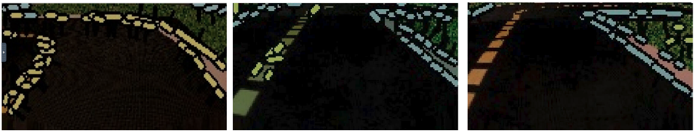
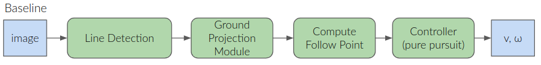
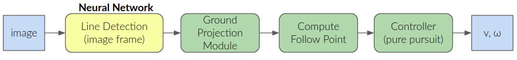
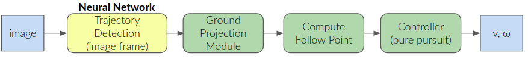
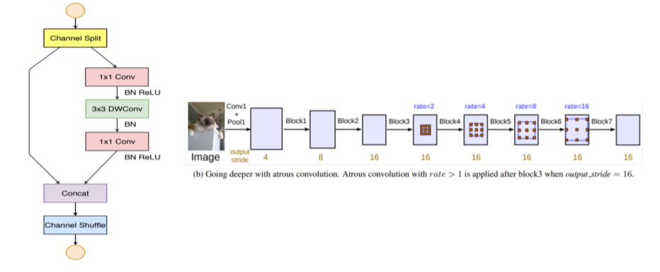
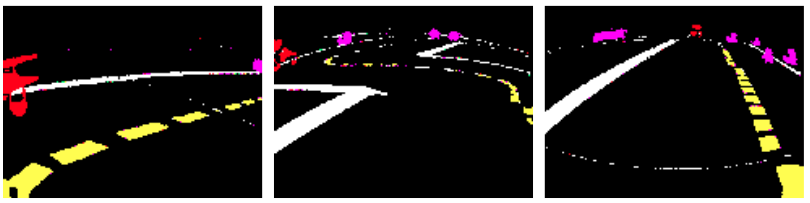
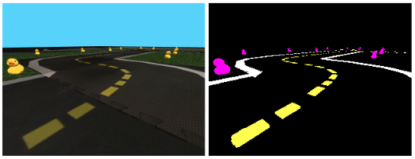
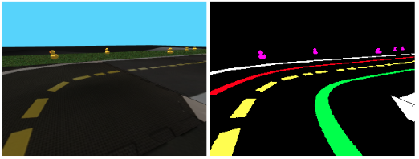

#  Harder, Better, Faster, Stronger : Project report {#Harder_Better_Faster_Stronger-final-report status=ready}

## The final result {#Harder_Better_Faster_Stronger-final-result}

This project is proposing two real-time semantic segmentation model variants that can be used to improve the computation of follow points in a pure pursuit control setting. 

Here is the performance on the duckiebot. Video is real-time, it's pretty fast!:
 
<figure id="example-embed4">
    <figcaption>Lane Following Performance on the Duckiebot</figcaption>
    <dtvideo src="vimeo:493473117"/>
</figure>

Depending on the variation of the Duckietown dataset, the validation IoU can reach about 75.6% on the validation set. Inference is real-time on i5 8600K desktop CPU (over 30 fps). 

### Detecting Lines with semantic segmentation

A first semantic segmentation model takes 160x120 images as input and generates the segmentation at 45 FPS on a i5 8600k CPU for five classes, namely: 1: yellow lines, 2: white lines, 3: obstacles, 4: duckiebots and 5: red lines . Segments are then extracted from the yellow and white lines, and projected into robot frame. A follow point is then obtained from these projected segments and fed to a pure pursuit controller.  
 
Here is the performance in the simulator:
 

<figure id="example-embed1">
    <figcaption>Lane following performance on the simulator</figcaption>
    <dtvideo src="vimeo:493139146"/>
</figure>
 

Here is the performance on the AIDO LF challenge:
 
<figure id="example-embed2">
    <figcaption>Lane Following Performance on the AIDO LF challenge</figcaption>
    <dtvideo src="vimeo:493139195"/>
</figure>
 

<figure id="example-embed100">
    <figcaption>Lane Following Performance on the Duckiebot, later that day</figcaption>
    <dtvideo src="vimeo:493555586"/>
</figure>

### Detecting bezier curves with semantic segmentation

A second semantic segmentation model takes 320x240 images as input and generates the segmentation at 30 FPS on a i5 8600k CPU for five classes, namely: 1: white lines, 2: yellow lines, 3: obstacles , 4: left bezier curve and 5: right bezier curve. A follow point is obtained from the right bezier curve projected segments and used in a pure pursuit controller. Yellow and white line projected segments are used when no bezier segment is visible in the image frame.
 
Here is the performance in the simulator:  
 

<figure id="example-embed999">
    <figcaption>Lane Following Performance in the simulator)</figcaption>
    <dtvideo src="vimeo:493444437"/>
    </figure>
    
 

Here is the performance on the AIDO LF challenge:
 

<figure id="example-embed5">
    <figcaption>Lane Following Performance on the AIDO LF challenge</figcaption>
    <dtvideo src="vimeo:493458156"/>
</figure>

Having access to a stable follow points allows to operate faster and take the turns harder! 

## Mission and Scope {#Harder_Better_Faster_Stronger-final-scope}
The objective is to provide a robust perception system that would allow better, faster and stronger performance for the Duckiebots. 

### Motivation {#Harder_Better_Faster_Stronger-final-result-motivation}

The track speed and accuracy of the Duckiebot is mainly limited by it’s perception system accuracy and latency. Empirical experiments through manual control show that a human can drive the Duckiebot significantly faster than the best available automated systems. The baseline line detections and projected segments are erratic and difficult to finetune. It is not uncommon to see white line segments being detected as yellow segments and vice versa. Some segments can also be missed completely. This often results in poor lane following performance. In recent years, more and more lightweight and accurate deep learning vision solutions have become available. The motivation behind this project was to improve the Duckiebot perception system using a robust low-latency deep neural network.
 

<figure id="example-embed6">
    <figcaption>The baseline line segments detection solution underperforms </figcaption>
    
</figure>

### Existing Solutions {#Harder_Better_Faster_Stronger-final-literature}

#### Baseline Solution {#Harder_Better_Faster_Stronger-final-literature-baseline}

In the current baseline solution :

 

-  Line detections are obtained from an input image, in the form of line segments of different colors (i.e. yellow, white and red)
-  Segments are projected in the robot frame
-  A suitable follow point is computed from ground projected segments
-  And used as the target by a pure pursuit controller to extract the target bot velocity and angular velocity
 

This is illustrated below: 
 

<figure id="example-embed7">
    <figcaption>Baseline</figcaption>
    
</figure>

#### Wiyatno et Al. Segmentation {#Harder_Better_Faster_Stronger-final-literature-rey}

[Some prior work for Rey Wiyatno et Al.](https://github.com/rrwiyatn/challenge-aido_LF-baseline-duckietown) used semantic segmentation. However, the previous work did not report either mAP along or framerate. They also did not directly predicted the middle of the lane to get optimal follow point without any filtering or additional computation.

Videos from their project suggested that there was room for improvement in terms of segmentation accuracy (mAP) and speed (Frame per Seconds). Also, the robot seemed to hesitate in turns, which suggested that the segmentation was not "clean" enough to provide a good signal for follow point prediction. The other possible explanation was that the model inference was too slow.  

### Opportunity. {#Harder_Better_Faster_Stronger-opportunity}
The baseline and previous work show that there is room for improvement for fast and accurate follow point prediction. This project aims to be used as a baseline for future work. 

We want to establish:

- What mAP a segmentation model can achieve on Duckietown while maintaining 30 frame per seconds.
- If a quality follow point can be estimated directly by a segmentation neural network.
- If we can be faster!

 

The goal of this project was to use a lightweight and accurate deep learning vision solution to handle lane marking detection and improve the follow point computation. In **Step 1**, the sub-optimal line detection module was replaced by a semantic segmentation model that detects white, yellow and red lines, in addition to duckies and duckiebots. In this approach, the same ground projection module and follow point computation logic is reused. The updated pipeline is shown below: 

 

<figure id="example-embed8">
    <figcaption>Step 1 - Solution</figcaption>
    
</figure>

 

In **Step 2**, a semantic segmentation model was trained to detect the middle of the right lane, using bezier curve annotations. In approach, the bezier curve segments are projected in robot frame, and used to compute a follow point directly. The pipeline is shown below:

 

<figure id="example-embed9">
    <figcaption>Step 2 - Solution</figcaption>
    
</figure>

 

## Background and Preliminaries 
### Semantic Segmentation Task {#Harder_Better_Faster_Stronger-final-semantic}
Semantically segmenting an image consists in classifying every pixel in an input image into one of the pre-defined class types. For this project, the following classes were used: white line, yellow line, red line, obstacles (duckies) and duckiebots. 

## Definition of the Problem
To be successful with this project, the following requirements had to be met: 
 

- Must be able to run in real-time on the Duckiebot. (Minimum ∽30 fps)
- Must be of high enough precision to represent an improvement relative to current state.
- Must be compatible with the Duckietown infrastructure. 
- Must be able to directrly predict follow point (for instance, bezier curve) using a neural network.

## Contribution / Added functionality {#Harder_Better_Faster_Stronger-final-contribution}

The contribution of this project includes: 
 

- A demonstration that it is possible to run a deep learning based perception system in real time (i.e. >30 FPS) and while doing so, improve the line detection performance, and as a result the lane following score on the LF aido challenge,
- A demonstration that inference can be done on higher resolution images in real-time. (320x240). 
- A demonstration that one can in fact directly detect an optimal trajectory in image frame, in the form of the right lane bezier curve and use that inference to compute a suitable follow point,
- A simple and effective strategy to ignore irrelevant, but real, white lines detections. 
- the project code, trained models as well as instructions to reproduce the results, on a public github repository: [https://github.com/rjean/mobile-segmentation](https://github.com/rjean/mobile-segmentation).
- The datasets.

### Model {#Harder_Better_Faster_Stronger-model}
In order to make fast and accurate inference of semantic segmentation, a lightweight semantic segmentation model named ShuffleNet v2 with atrous convolutions was used. This model uses the ShuffleNet v2 architecture as its backbone, as well as DeepLabV3 and DPC heads built on top to perform the segmentation prediction .  

 

In order to extract denser features we remove the downsampling operations from the last few layers and upsample the corresponding filter kernels using atrous convolutions .
 
<figure id="example-embed13">
    <figcaption>Model Architecture</figcaption>
    
</figure>

### Pre-training {#Harder_Better_Faster_Stronger-pretraining}
The model we chose was pre-trained on the Cityscapes dataset, with a validation mAP of over 70%. 

### Datasets {#Harder_Better_Faster_Stronger-final-problem-dataset}

Two datasets were used for training the semantic segmentation model.

#### Classic Segmentation - "merged_with_real"
 For **Step 1**, the dataset from a previous project  was utilized. It contains 50,000 160x120 annotated images from the simulator as well as 200 real images with annotations. Sample images are shown below: 
 

<figure id="example-embed10">
    <figcaption>Reutilization of previous semantic segmentation dataset</figcaption>
    
</figure>

 

In addition, an additional 10,000 320x240 images were generated using the duckiebot-gym. A sample image is shown below: 

 

<figure id="example-embed11">
    <figcaption>Reutilization of previous semantic segmentation dataset</figcaption>
    
</figure>

 

Those images where downsample to 160x120 in order to build a bigger dataset by merging the 200 real images, 50000 images from Rey's dataset, and 10000 additional images from the latest simulator.

#### Higher Resolution Bezier Segmentation 

For **Step 2**, the goal was to be able to detect the middle of the lane. Thus, as annotations, the bezier curves from the duckiebot-gym were extracted and thickened out. They were classified differently depending on if they were on the left lane or the right lane. This new dataset is composed of 10,000 320x240 images along with the semantic segmentation annotations.  An example of such segmentation mask is shown below: 
 

<figure id="example-embed12">
    <figcaption>Generation of new semantic segmentation dataset</figcaption>
    
</figure>

### Ground Projection and Post Processing
Countours are extracted for each of the relevant segmentations mask (i.e. yellow lines, bezier lines). 

For the white lines, it is possible to get distracted by other legitimate white lines that could be on another tile. In order to filter them out, we keep only the points that are closest to the bottom of the picture. This approximates only keeping the closest whites lines to the Duckiebot.

The locations of those points are then ground projected and broadcasted, to be used by the Follow Point Predictor and Controller node. 

### Follow Point Predictor and Controller

In order to demonstrate the performance of the perception system, we provide a novel pure-pursuit controller.

The following video shows the ground projected white and yellow line segments, along with their respective regressed lines. For each regressed line, a follow point is computed, and a mean follow point is used for the pure pursuit control.
 

<figure id="example-embed142">
    <figcaption>Ground projected white and yellow line segments with linear regression and follow point computation</figcaption>
    <dtvideo src="vimeo:493479254"/>
</figure>
 

This controller has a P-D controller tuned with agressive gains. The derivative component allow reacting to transients, such as when entering a curve, while the proportional term mostly contributes to correcting the trajectory in straigt lines. There is also a tunable low-pass filter to remove follow point variation that can happen due to noise, and allow more stable trajectories, at the expense of an longer reaction time. 

### Platform Agnostic Inference using ONNX
In order to avoid dependency hell that happens when integrating lots of dependencies in the solution, such as Pytorch or Tensorflow, we instead used ONNX, which allows importing neural networks with a single dependency. This workflow allows creating models in any framework then using them without modification in the "production" code, as long as the input size and output size stays the same. This workflow should also work on the Jetson Nano.

## Formal performance evaluation / Results {#Harder_Better_Faster_Stronger-final-formal}

The yellow and white line segmentation model (i.e. **Step 1**) can run at 45 FPS on cpu and enabled reaching a top-5 performance on the AIDO LF challenge. The lane bezier curve segmentation model (i.e. **Step 2**) can run at 30 FPS on cpu and enabled achieving even greater performance compared to using the yellow and white line segmentation model. Both solutions were integrated into the Duckietown infrastructure. As such, the project goal and requirements are successfully met.  

 
As far as limitations, the current solution has good performance when the input image is in-domain, i.e. statistically close to the images used for training the model. However, the semantic segmentation model is found to perform poorly on the Duckiebot when no real image is included in the dataset. In other words, sim two real transfer is poor when no real image is seen during training. No real annotated image was available for training the bezier curve segmentation model (**Step 2**) and as a result, performance deteriorates so much in real that it does not deliver improved results compared to the baseline solution.  

Dataset&nbsp; | &nbsp;Epochs&nbsp; | &nbsp;Resolution&nbsp; | &nbsp;Framerate (i5 8600k)&nbsp; | &nbsp;mAP  
--- | --- | --- | --- | ---
merged_with_real&nbsp; | &nbsp;3&nbsp; | &nbsp;160x120&nbsp; | &nbsp;31.35&nbsp; | &nbsp;73.8%
bezier&nbsp; | &nbsp;3&nbsp; | &nbsp;320x240&nbsp; | &nbsp;28.9&nbsp; | &nbsp;60.9%

The Bezier model has a lower mAP, this can be attributed to the lower number of samples in the dataset. (10000 instead of 60000). The framerate is approximately the same for both models, even though the input size is larger on the bezier model. This is due to the internal upscaling of our model. 

It is still possible to improve those models by a few percentage points by training a little longer, will a learning rate schedule.

## Future avenues of development {#Harder_Better_Faster_Stronger-final-next-steps}

The following ideas could help improve the performance further:

- ONNX inference on GPU instead of CPU which would enable reducing latency further and/or increasing model complexity,
- Fine-tuning on real data and adapting the controller for when running on the duckiebot, to improve performance in real,
- Add filtering (e.g. Kalman) for the follow point estimation, to smooth-out steering from one segmented frame to the next. 
- More Data!

