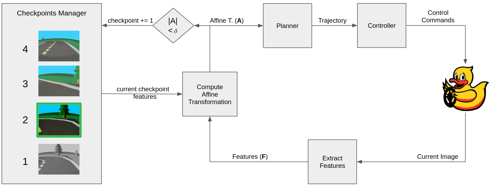
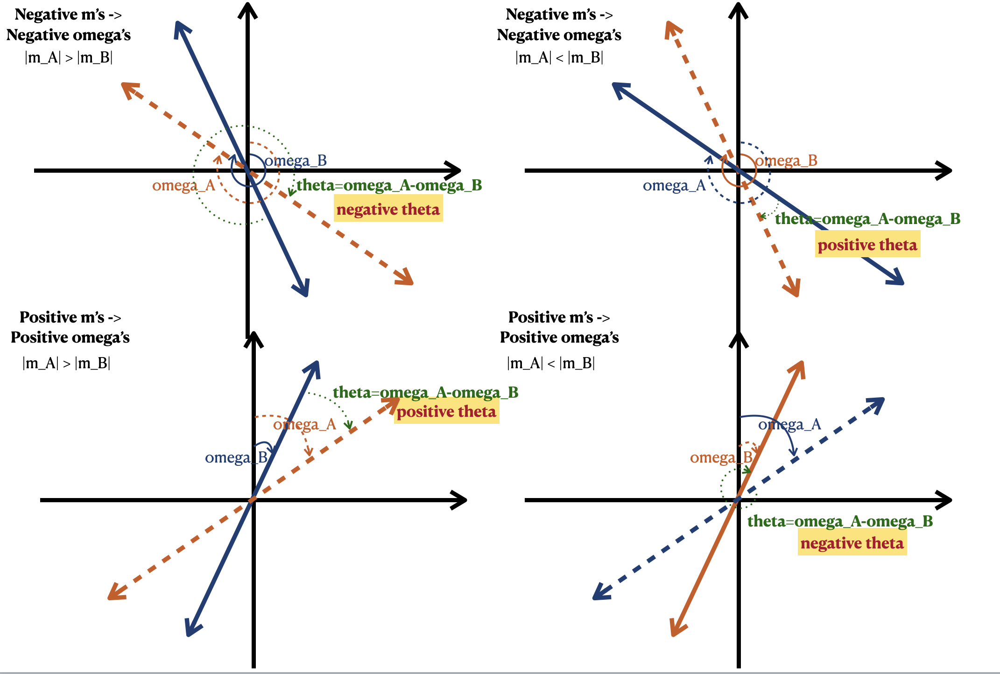
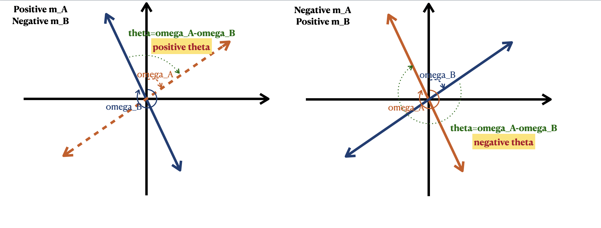
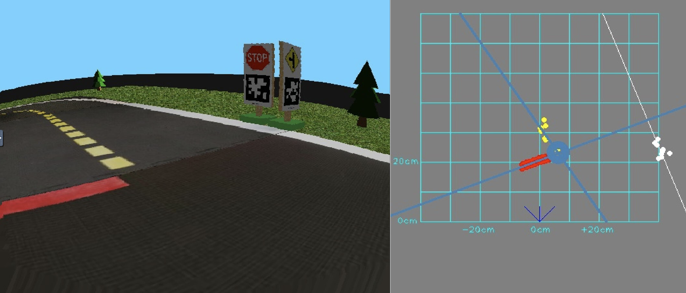
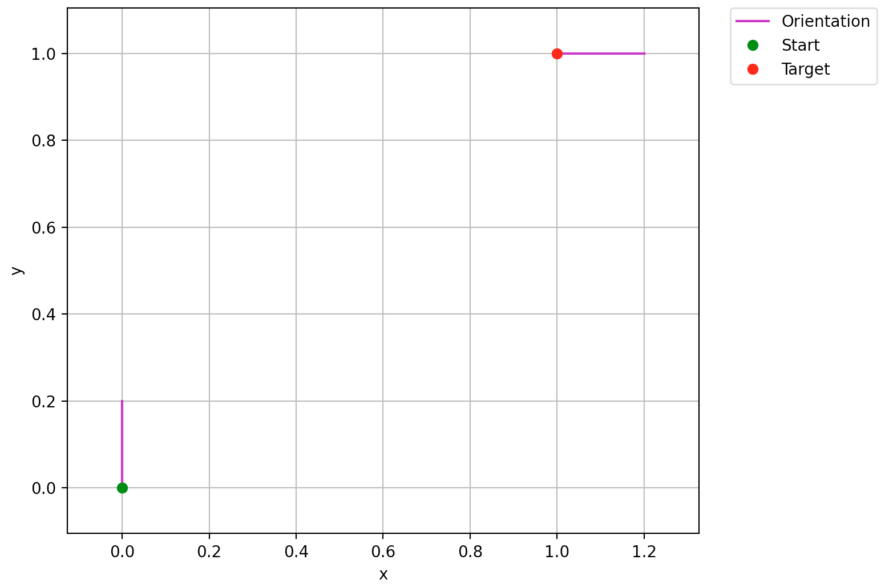
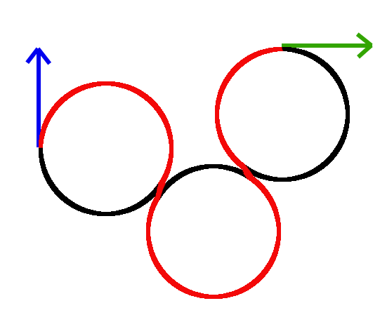
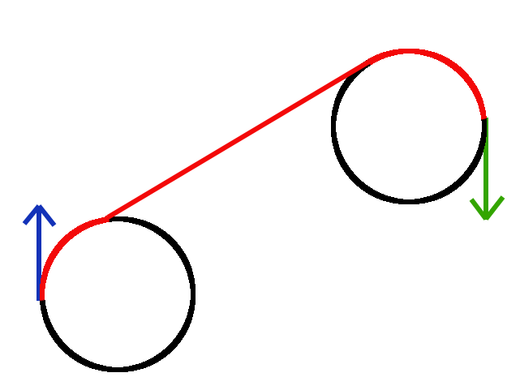
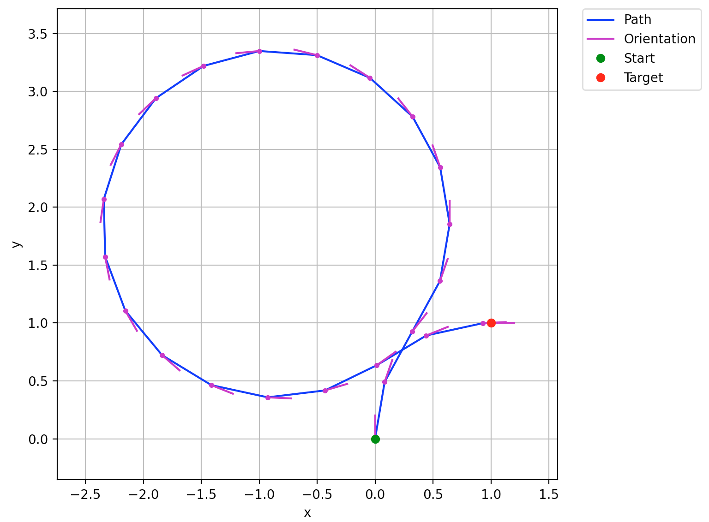
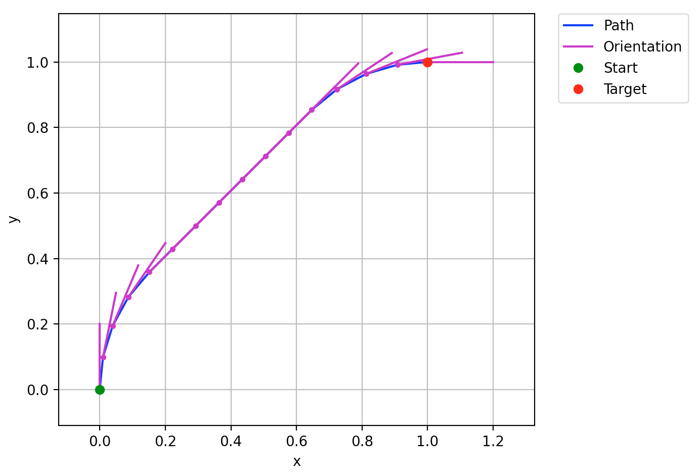

#  Cross Pro-Duck: Project report {#cross-pro-duck-final-report status=ready}
## The final result {#cross-pro-duck-final-result}

The final best results of the overall algorithm are shown in the videos below. As can be seen, it is possible to achieve a visual-servoing feedback loop in intersection crossing using this algorithm. Unfortunately, this is currently limited to right turns, crossing straight, and red line approaching/lane following. This approach is also currently not very robust.

Please refer to the [instructions to reproduce](#instructions-cross-pro-duck) to reproduce these results.

<figure id="cross-right_turn">
    <figcaption> Successful Right Turns.</figcaption>
    <dtvideo src="vimeo:495935292"/>
</figure>

<figure id="cross-lane_follow">
    <figcaption> Successful Lane Following with Red Line Approach.</figcaption>
    <dtvideo src="vimeo:495954271"/>
</figure>

<figure id="cross-straight_turn">
    <figcaption> Successful Straight Crossing.</figcaption>
    <dtvideo src="vimeo:495954451"/>
</figure>


## Project Goals {#cross_pro-duck-final-problem-def}

**Overall Goal:** Apply visual servoing techniques in order to construct a feedback control loop for duckietown tasks such as intersection crossing and lane following.

In this project, we apply computer vision techniques to extract useful visual information to control the motion of the duckiebots. Specifically, we want to guide the duckbiebot based on the mutual information captured in the reference and current images. The mutual information is usually some aligned visual features between the two images. Typically, the salient features are identified from the reference and target separately by a feature extractor and they are matched by a feature matcher. The matched features would be exploited to compute helpful information to assist the duckiebots in the intersection crossing tasks.


## Background and Preliminaries {#cross-pro-duck-final-preliminaries}

### Visual Servoing

Visual servo control is a field of study focused on controlling robots based on the given visual data. The goal of visual servo control is to minimize the differences between a set of reference features and a set of observed features[^10.1109/MRA.2006.250573]: 

\begin{equation}
e(t) = \mathbf{F}(m(t), \theta)-\mathbf{F}^*
\end{equation}

where $m(t)$ is the observed image at time $t$, $\mathbf{F}$ represents the feature extractor and $\theta$ is a set of parameters for the feature extractor. On the other hand, $\mathbf{F}^*$ is a set of the desired (reference) features. In our project, $\mathbf{F}^*$ is defined as $\mathbf{F}(m^*, \theta)$ where $m^*$ is our checkpoint image. Visual servoing encompasses both approaches where the features are present in the image space, and those that are present in the projected space as in this project.

### Image Alignment in Computer Vision
Visual features are defined differently across visual servoing tasks. Most work relies on the image points to conduct visual servoing. For example, [^10.1109/70.538972] and [^10.1109/70.88086] use image coordinates to define the image features.  Other types of visual features (such as lines, image moments, moment invariants) are also used in visual servoing tasks [^10.1177/027836402761412430]. In this project, we explore the possibility of combining different types of visual features to obtain feasible input for the control model. Specifically, we utilize the point and line features from the observed and reference images to construct an affine matrix as input for the control model. Our objective functions for feature alignment is: 

\begin{equation}
e(t) = \big(\mathbf{P}(m(t), \theta)-\mathbf{P}(m^*, \theta)\big)+\big(\mathbf{L}(m(t), \theta)-\mathbf{L}(m^*, \theta)\big)
\end{equation}

 where $\mathbf{P}$ is the point feature extractor and $\mathbf{L}$ is the line feature extractor.

### Visual Servo Control
The controller used in visual servoing applications depends greatly on the type of features extracted by the vision algorithm. In image-based (IBVS) approaches, where features are matched in the image space, the controller revolves around transforming image space dynamics into real world dynamics. This involves building a so called *interaction matrix*, which relates the velocity of features in image space to the velocity of the camera in the real world. This task can be challenging depending on the system at hand and is highly dependent on the quality and consistency of features detected.

An alternative is the pose-based (PBVS) approach, which uses computer vision to directly estimate the current pose of the robot in the real world. Traditional controls approaches can then be taken to provide inputs.

The approach that we take in our algorithm is a hybrid approach which incorporates features of both IBVS and PBVS. The output of the vision algorithm is a homography between the current and target images projected in the ground plane. Although we are using image features directly, the fact that they are projected onto the ground plane means that we can treat the homography between them as an $SE(2)$ target for the duckie to reach. Therefore, the required controller becomes significantly more simple as it deals with the vision output as a direct target pose.


## Overview

### Visual Path Following
Our primary contribution toward Duckietown is providing its Duckizens the ability to follow trajectories given to them in the form of sequence of images. Currently, duckies can only perform certain predefined operations well such as following a specific lane. They rely on specific hard-coded rules such as always being to the right of the yellow line and to the left of the white line in order to achieve those operations. Because of this, they especially struggle to cross intersections where there are no generalizable line patterns. Our goal is to give them the power to follow any kind of path they want to with ease by just providing them a set of path images. These images act as a sample for the actions to take and our approach is expected to be robust to different environments. For this proof-of-concept project, we restrict our scope to evaluating our approach on lane following and crossing intersections via going straight and turning right.

#### Existing Implementation for Intersection Navigation
Currently, intersection crossing is done using an open-loop control. When a duckie arrives at a crossing, identified by red lines, it is fed a series of open-loop inputs corresponding to the approximately ideal inputs needed to accomplish a turn in a desired location. The goal of these open loop controls is to move the duckie to a close enough location to the desired lane entrance that the standard lane controller will be able to pick up the correct white and yellow line to continue lane following. This approach, like most open-loop approaches, is not robust and can easily lead to duckies entering incorrect lanes or flying out of the intersection altogether. As such, the visual servoing approach was chosen as a way to include closed-loop controls in the intersection crossing task in order to improve the robustness and safety for all duckies going through an intersections.

### Architecture

<figure class="flow-subfigures">  
    <figcaption>Overview of Cross Pro-Duck.</figcaption>
    
</figure>


Our algorithm's role is to help a duckie reach its destination by iteratively guiding it through a set of checkpoints. To achieve this, our architecture consists of three major components: Vision-based Feature Extractor, Duckie Controller, and Checkpoint Manager. Navigation starts with the checkpoint manager loading a set of pre-recorded checkpoint images and setting the first checkpoint image as the initial target. The checkpoint image and the duckie's current image are then sent to the feature extractor which uses algorithms such as line detection, intersecting points detection, pairwise-matching etc. (explained in more detail in the next section) to compute an affine transformation matrix. This matrix estimates the direction and distance for the duckie to move in order to match its view with the checkpoint. The planner then takes this information to estimate a trajectory for the duckie to reach the checkpoint and the controller is tasked with following this trajectory. Throughout the duckie's journey, the checkpoint manager keeps track of its progress and switches checkpoints as the duckie passes through them.

## Algorithms


### Infrastructure
We take advantage of the existing ROS-based Duckietown infrastructure to support various algorithms in our approach. We modify the default `LineDetectorNode`, `LaneFilterNode`, and `LaneControllerNode` ROS nodes to seamlessly integrate our solution in the Duckietown stack. We also implement various visualizations in ROS which help us keep track of the state of duckie's motion. We list down the algorithms implemented within the major components of our solution below: 


### Computer Vision

* Detecting color coordinates
* Ground projection
* Distance-based filtering
* Clustering
* Regression
* Lines parallelization
* Intersection computation
* Line matching
* Point matching
* Affine (SE2) Transformation

In the vision component of this project, we compute the SE2 transformation matrix based on three lines (the red, yellow, white lanes) and two points (the intersection of the red+yellow lanes and the intersection of the red+white lanes).

In order to compute a feasible affine matrix for the control model, we rely on several assumptions about the ground projected lanes:

* the ground projected white lane and the ground projected yellow lane are parallel
* the ground projected white lane and the ground projected yellow lane are perpendicular to the red lane
* the distance between the ground projected white lane and the ground projected yellow lane are always constant

These assumptions are crucial because they enforce the transformation matrix between the reference image and the observed image contains purely rotation and translation information (no scaling and shearing information).

Knowing these assumptions, the computer vision component of this project breaks down into two major parts: obtain the ground projected lanes following these assumptions and compute an affine matrix by matching lines and points.

To compute the ground projected lines, we first obtain the lane coordinates for each color, project them onto the ground plane and filter out the points that are too far from the duckiebot. The ground projected points are grouped based on their proximity to the other points using agglomerative clustering technique with single linkage between the clusters. Huber regressor is used to render line regression on the lane coordinates for each color and for each cluster. In theory, the three lines computed should adhere to the assumption we made about the ground projected lanes. However, the camera used on the duckiebots does not provide the depth information. Thus, we can alter the slopes and intercepts of the lines to make these assumptions hold. (Note: In the following model for computing affine transformation matrix, it does not require us to execute the line parallelization algorithm since it takes only one line and one point as inputs. However, the following model is faultless only when the assumptions listed above hold.)

The affine matrix is computed by a pair of matched lines and a pair of matched points. Let $l_{\text{ref}}$ and $l_{\text{t}}$ be the matched reference and observed lines respectively and $p_{\text{ref}}$ and $p_{\text{t}}$ be the matched points respectively. Lines and points are defined by their homogeneous coordinates (i.e. $l=(a,b,c)$ and $p=(x,y,1)$; for every point $p$ on line $l$, we have $l\cdot p = 0$). The slope of line $l$ can be computed as $m(l) = -\frac{a}{b}$. The affine matrix without scaling and shearing components is defined as 
\begin{equation}
    \mathbf{A} = \begin{bmatrix}
    \text{cos}(\theta) & -\text{sin}(\theta) & t_x \\
    \text{sin}(\theta) & \text{cos}(\theta) & t_y \\
    0 & 0 & 1 \end{bmatrix}
\end{equation}

Given $l_{\text{ref}}$, $l_{\text{t}}$ and $p_{\text{ref}}$, $p_{\text{t}}$, the transformation matrix from the ground projected reference plane to the ground projected current plane can be computed by defining $\theta$ as the angle of rotation between $l_{\text{ref}}$ and $l_{\text{t}}$ 

\begin{equation}
\theta = \arctan(m(l_{\text{t}}))-\arctan(m(l_{\text{ref}}))
\end{equation}

and $t$ defined as the displace between $p_{\text{ref}}$ and $p_{\text{t}}$ 

\begin{equation}
t = p_{\text{t}}-p_{\text{ref}}
\end{equation}

The following plots illustrate that the relationship between $\theta$ and the lines' slopes. 

<figure class="flow-subfigures">  
    <figcaption>Overview of theta computation.</figcaption>
    <figure>      
          
    </figure>  
    <figure>       
          
    </figure>  
</figure>
*How to compute ($l_{\text{ref}}$, $l_{\text{t}}$)?* 
The matched lines are determined according to the line regression results. $l_{\text{ref}}$, $l_{\text{t}}$ are the yellow lines' homogeneous coordinates if the yellow lines are detected. Otherwise, we use the red lines coordinates. Lastly, we use the white lines coordinates if the red lines are also not detected.

*How to compute ($p_{\text{ref}}$, $p_{\text{t}}$)?*
Let line $l_1 = (a_1, b_1, c_1)$ and line $l_2 = (a_2, b_2, c_2)$.  Let the intersection of $l_1$ and $l_2$ be $(x_{\text{intercept}},y_{\text{intercept}})$. We have
\begin{array}{c}
a_1x_{\text{intercept}} + b_1y_{\text{intercept}} + c_1 = 0\\
a_2x_{\text{intercept}} + b_2y_{\text{intercept}} + c_2 = 0\\
\end{array}
We can solve for $(x_{\text{intercept}},y_{\text{intercept}})$ using linear system:

\begin{equation}\begin{vmatrix}-c_1\\
-c_2
\end{vmatrix} =  \begin{vmatrix}a_1 & b_1 \\a_2 & b_2\end{vmatrix}\begin{vmatrix}
x_{\text{intercept}}\\
y_{\text{intercept}}
\end{vmatrix}
\end{equation}

Assume we have a function named `get_intersections` that computes the x- and y-intercept of two homogeneous lines. The following pseudo-code depicts the algorithm for computing the matched points ($p_{\text{ref}}$, $p_{\text{t}}$):
```
function compute_matching_points(ref_lines, curr_lines, ref_white_im, curr_white_im):
    if matched red and yellow lines are detected:
        ## return their intersections
        return get_intersections(ref_red_l, ref_yellow_l),
               get_intersections(curr_red_l, curr_yellow_l)
    else if matched red and white lines are detected:
        ## return their intersections
        return get_intersections(ref_red_l, ref_white_l),
               get_intersections(curr_red_l, curr_white_l)
    else if only matched white lines detected:
        # note that white_im is the masked image of the white lane
        # note that good_feature_to_track returns a list of with decreasing feature quality
        
        ref_corners, curr_corners = good_feature_to_track(ref_white_im, curr_white_im)
        iterate over corners and compute the corners' distances from white_l:
            if a pair of corners whose distance from white_l is close to 0:
                project the corners to ground plane and return them
                
    return NoMatchedFound
```

Note that the distance between a point and a line is the dot product of their homogeneous coordinates, and the `good_feature_to_track` function is the implementation of the published work [^10.1109/CVPR.1994.323794]. The image below shows an example of computing yellow/red intersection point given yellow and red lines.

<figure class="flow-subfigures">  
    <figcaption>Example of line and point matching.</figcaption>
    
</figure>

If only one pair of matched line is detected (no matched points detected), then the rotation matrix would be returned. If no matched point nor matched line is detected, then nothing would be returned from the vision module and the control model would handle the missing detection scenario.

### Planning
The planner only knows about and only receives the $SE(2)$ transformation in the form

\begin{equation}
    \mathbf{X} = \begin{bmatrix}\mathbf{C}_{tc} & \mathbf{r}_c^{oq} \\ \mathbf{0} & 1 \end{bmatrix} \in SE(2),
\end{equation}

where $t$ denotes the target frame of reference, $c$ the current frame of reference, $q$ the origin in the target frame and $o$ the origin in the current frame. $\mathbf{C}$ is the rotation matrix between the current and target frame and $\mathbf{r}$ is the translational component between the current origin and the target origin. With this definition, the planner takes the desired transformation matrix and simply uses it as a target state, with the current pose is always taken to be "0", with $\mathbf{C} = \mathbf{1}$ and $\mathbf{r} = \mathbf{0}$. A toy example with the received target pose is shown below. Note that here $\theta = 0$ is pointing up.

<figure class="flow-subfigures">  
    <figcaption>Sample current and target pose received by the planner.</figcaption>
    
</figure>
**Dubins Path:** Having a current and target state, the planner is built upon a dubins path algorithm. The duckiebot is modeled as Dubins Car, meaning it can only

* Go **S**traight at constant speed $v$,
* Turn **L**eft at maximum angular velocity $\omega$, or
* Turn **R**ight at maximum angular velocity $-\omega$.

It was shown in [^dubins] that the shortest path between two points for such a car would one of the combinations
\begin{equation}
\{ \mathbf{L}\mathbf{R}\mathbf{L}, \mathbf{R}\mathbf{L}\mathbf{R}, \mathbf{L}\mathbf{S}\mathbf{L}, \mathbf{R}\mathbf{S}\mathbf{R}, \mathbf{L}\mathbf{S}\mathbf{R}, \mathbf{R}\mathbf{S}\mathbf{L} \}.
\end{equation}

Example paths are shown in the images below, which are taken from [^dubin_curves].

<figure class="flow-subfigures">  
    <figcaption>Sample RLR and RSR Dubin curves.</figcaption>
    <figure>      
          
    </figure>  
    <figure>       
          
    </figure>  
</figure>

* The path is dependent on the minimum curvature producible by the car.
* The duckiebot can "cheat" at being a Dubins Car since it can turn on the spot. This is key to avoiding generated paths that involve huge loops such as the one shown in the image below.
* This allows for paths that always point the camera towards the next checkpoint.

<figure class="flow-subfigures">  
    <figcaption>A Dubin path between the current and target pose with a minimum curvature of 2 units on the top and 0.5 on the bottom.</figcaption>
    <figure>      
          
    </figure>  
    <figure>       
          
    </figure>  
</figure>


* Dubins path planning becomes a simple way to compute a trajectory where the camera is always pointing towards the next checkpoint.
* The set of forward velocities $v$ and angular velocity $\omega$ at each time step is computed via forward Euler discretization.


### Control
The planner produces a set of

* poses $\mathbf{x}$,
* linear velocities $\mathbf{v}$, and
* angular velocities $\pmb{\omega}$,
  

for some set of time steps $k$. The controller then simply executes these generated inputs until a new measurement is available. Since new measurements arrive very quickly, it is rare for more than the first inputs to be executed. However, the robustness is there in case it is needed.

A number of additional checks and balances are also included to handle situations where only orientation information is available and for fringe situations. The controller is ultimately very simple on the account that the distances in the intersection are very short and new measurements arrive quickly. The reader is referred to the [failure section](#cross-pro-duck-final-failures) for additional information about considered control options.


### Checkpoints Manager
* The checkpoints manager supports easy collection, saving, and loading of checkpoints with the click of a button
* It keeps track of the current checkpoint and switches the checkpoint when the affine transformation is almost equal to an identity matrix

## Results {#cross-pro-duck-final-formal}
No numerical evaluation criteria are defined at this stage of the project. A possible criteria could be the percent of successful turns, however the algorithm is not currently robust enough to produce good results frequently enough for this to be a worthwhile metric. 

Qualitatively, the presented algorithm can serve as a proof of concept that visual servoing could in fact be used for intersection crossing and lane following. As can be seen in the videos presented in [the results overview section](#cross-pro-duck-final-result), when the algorithm works it works very well. 

Unfortunately, the algorithm does not currently perform very robustly. A likely reason is the inconsistency of the line detection and mismatches happening due to a lack of checks and balances. For example, the algorithm will sometimes match a corner that is off the visible screen, which is clearly not a good match. These checks and balances are only found during testing, and we unfortunately ran out of time to implement all of them. 

Nonetheless, the feasibility of this approach has been proven and it is hoped that subsequent work will occur to implement the next steps listed below. Please refer to [this instructions section](#demo-cross-pro-duck-failure) for some fun failure videos!


## Future avenues of development {#cross-pro-duck-final-next-steps}
Here we list down the aspects of our solution which can be tuned to greatly improve the outcome given more time.

* Line detection: Solving a vision driven task, our solution heavily relies on correctly estimating image features such as lines and their colors. An accurate line detection module is even more important for navigating intersections since the bot needs to rely on several distant lines in all directions to estimate its state. We found our solution to mostly be limited by line detection's accuracy and we see a potentially better solution as a direct result of improving this module with more experimentation.
* Algorithm start: The algorithm currently relies on the bot being in front of a red line marking the end of one line. As such, it would be necessary to implement a "pre-roll" in order to move into a better location for visual servoing to start.
* User interface: The fully envisioned algorithm would be capable of traversing a duckietown fully autonomously, only requiring user input for decisions as to where to turn. With additional time, it would be great to implement loading in all 3 types of turns, as well as line following. The procedure could then be automated so that it would automatically enter lane following up until it reaches a red line, at which point the user could click an arrow to indicate which way the bot should turn. After executing the turn, the bot would automatically enter lane following again and repeat.
* PID controller overlay: In order to improve the controller it would be good to overlay a PID or simply a D control law on top of the planned dubins path to ensure smoother accelerations.
* Filtered target: Due to the "jumpiness" of the line detection, it would be good to have a filter or even just an averager for the desired pose which could smooth the measurements and decrease the sudden shift in input values.


## Contribution / Added functionality {#cross-pro-duck-final-contribution}
The exact contributions of our work can be summarized as follows.

* An algorithm capable of reaching a reference/checkpoint duckietown lane image from a nearby position where at least some similar lines are visible.
* A checkpoint management system capable of recording checkpoints, saving them for later use, and automatically switching from checkpoint to checkpoint during a control sequence.
* A computer vision module capable of detecting and projecting all visible road lines. The module is additionally capable of determining corners where a red line meets either a yellow or a white line. Finally, this module can also determine matching lines and points between two images close to each other in physical space.
* A dubins path planning algorithm capable of reaching a target $SE(2)$ pose.

## Recorded Failures and Changes {#cross-pro-duck-final-failures}
This section is meant to list out some of the approaches that were considered or implemented and why they were not used in the final submission. The goal is for this to serve as a list of ideas and warnings for anyone interested in continuing this work.


### Vision
* Initially, we employed SIFT algorithm as our vision model. It succeeded in capturing image features in the background but failed in capturing image features on the lanes due to the reasons: 1. the background is more complex and the magnitudes of the image gradients are high in the background; 2. a lot of mismatched features on the lanes due to the scale, rotation and photometric invariant properties of SIFT (the image patches are similar and repetitive on the lanes).
* To avoid the problems with SIFT, we experimented with several homography computation approaches that allow us to compute the homography matrix using line and point information interchangeably. These models yield decent homography matrices. However, they rely heavily on perfect detection of the lanes and the homography computed is infeasible for the control model.
* Additionally, we intended to replace the homography matrices with affine matrices. We implemented an algorithm which computes affine matrices with 6 DOF. However, we realized that the affine matrix computed exhibits scaling and shearing effects on translation. Thus, we added restrictions to our line detections model and this led to our final model.
### Planning/Control
* Originally, an optimal Model Predictive Control (MPC) strategy was considered. However, because the trajectory was only ever planned for short distances given the nature of the problem, the added complexity was deemed unnecessary and the inputs from the planner were fed in directly.
* In hindsight, perhaps a dubins algorithm is not necessary and a simple PID loop would work. Due to the shortness of the trajectory and the frequency of updates, the dubins path is frequently only a couple of steps long and is rarely followed through to the second input. In theory however, it will nonetheless be more robust than a PID controller.

## Reference

[^dubin_curves]: A. Giese, “A Comprehensive , Step-by-Step Tutorial to Computing Dubin’s Paths,”Andy G’s Blog, pp. 1–20, 2012. [Online]. Available:https://gieseanw.wordpress.com/2012/10/21/a-comprehensive-step-by-step-tutorial-to-computing-dubins-paths/.
[^dubins]: L. E. Dubins, “On Curves of Minimal Length with a Constraint on AverageCurvature, and with Prescribed Initial and Terminal Positions and Tangents,”American Journal of Mathematics, vol. 79, no. 3, p. 497, 1957.

[^10.1109/70.538972]: S. Hutchinson, G. D. Hager and P. I. Corke, "A tutorial on visual servo control," in IEEE Transactions on Robotics and Automation, vol. 12, no. 5, pp. 651-670, Oct. 1996, doi: 10.1109/70.538972.

[^10.1109/70.88086]: J. T. Feddema and O. R. Mitchell, "Vision-guided servoing with feature-based trajectory generation (for robots)," in IEEE Transactions on Robotics and Automation, vol. 5, no. 5, pp. 691-700, Oct. 1989, doi: 10.1109/70.88086.

[^10.1109/MRA.2006.250573]: F. Chaumette and S. Hutchinson, "Visual servo control. I. Basic approaches," in IEEE Robotics and Automation Magazine, vol. 13, no. 4, pp. 82-90, Dec. 2006, doi: 10.1109/MRA.2006.250573.

[^10.1177/027836402761412430]: Andreff N, Espiau B, Horaud R. Visual Servoing from Lines. The International Journal of Robotics Research. 2002;21(8):679-699. doi:10.1177/027836402761412430

[^10.1007/s00453-012-9717-4]: Ackermann, M.R., Blömer, J., Kuntze, D. et al. Analysis of Agglomerative Clustering. Algorithmica 69, 184–215 (2014). doi:10.1007/s00453-012-9717-4

[^10.1109/CVPR.1994.323794]: Jianbo Shi and Tomasi, "Good features to track," 1994 Proceedings of IEEE Conference on Computer Vision and Pattern Recognition, Seattle, WA, USA, 1994, pp. 593-600, doi: 10.1109/CVPR.1994.323794.
