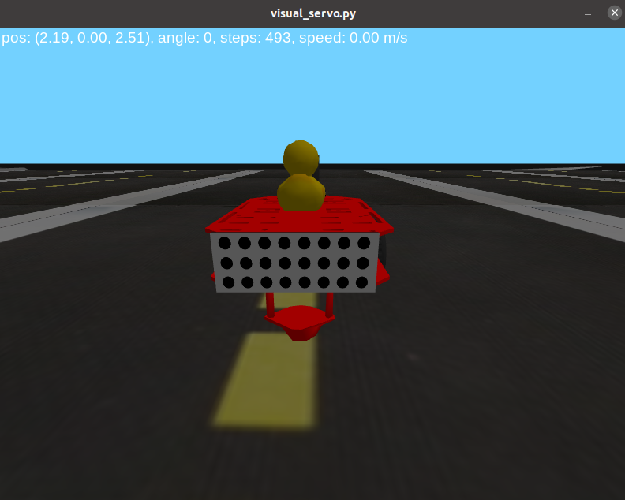

#  Duckling controller : Project report {#duckling_controller-final-report status=ready}

## The final result {#duckling_controller-final-result}

_Let's start from a teaser._

* Post a video of your best results (e.g., your demo video): remember to have duckies on the robots or something terrible might happen!

You might want to add as a caption a link to your [instructions to reproduce](#instructions-duckling_controller) to reproduce these results.
Moreover, add a link to the readme.txt of your code.

## Mission and Scope {#duckling_controller-final-scope}

Our mission is to create a controller that is capable of using images from the duckiebot's camera to follow another duckiebot and stop a certain distance away, in line with its rear. We would like to implement this controller in the duckiebot and also a similar controller that would be able to only stop behind another duckiebot using the simulator.
<p>&nbsp;</p>
Our duckiebot has a camera with fisheye lens installed on it. This configuration is called eye-in-hand because it is rigidly mounted on the robot. Our target is at a certain distance of the bumper of other duckiebot. The bumper has a circle's pattern: 8 columns by 3 rows on simulator and 7 columns by 3 rows on the duckiebot.

<p>&nbsp;</p>


## Motivation {#duckling_controller-final-result-motivation}

This project is a visual servo controller that is a technique of using visual sensors to control the movements of a robot. 
<p>&nbsp;</p>
This project is of great importance as it has many applications. Visual servoing can be used to pick up an object from one place and place it in another, or to follow and track an object by an autonomous vehicle.


## Existing solution {#duckling_controller-final-literature}

Visual servoing is the use of visual sensors in order to control the motion of the robot. There are three main approach to tackle this problem. One is called positional-based visual servo (PBVS), another is called Image-based visual servo (IBVS) and the third one is an hybrid that combines the two first. For more information about both methods [1] and a comparison in results [2]

<p>&nbsp;</p>

1. *S. Hutchinson, G. D. Hager, and P. I. Corke, “A tutorial on visual servo control,” IEEE Transactions on Robotics and Automation, vol. 12, no. 5, pp. 651–670, 1996.*
2. *G. Palmieri, M. Palpacelli, M. Battistelli, and M. Callegari, "A Comparison between Position-Based and Image-Based Dynamic Visual Servoings in the Control of a Translating Parallel Manipulator"*


### Positional-based visual servo (PBVS) {#duckling_controller-final-pbvs}

The positional-based visual servo control the task is defined in 3D Cartesian frame. The visual data tries to reconstruct the 3D pose of the camera and the kinematic error is generated in Cartesian space.
<p>&nbsp;</p>
In order to perform a PBVS, the follow steps is necessary:

<p>&nbsp;</p>

1. 3D camera calibration:
    * Intrinsic parameters that deppends exclusively on the camera, such as its optical center and focal length;
    * Extrinsic parameters represents the location of the camera in the 3D scene.
2. Estimate the POSE at certain frequency since it deppends on the motion of the camera and/or the target.
3. Control the motion of the robot in order minimize the kinematic error.

<p>&nbsp;</p>

This method is very sensitive to calibrations errors.

### Image-based visual servo (IBVS) {#duckling_controller-final-ibvs}

The image-based visual servo control the error is calculated in 2D image feature parameters.

<p>&nbsp;</p>

1. Define the interaction matrix Le that relates the Cartesian velocity with the image space velocity. This matrix depends on: the focal length expressed in pixel, image-space vectors s = {u, v, d}^T, and the z estimated.

2. Control de motion of the robot to minimize the distance between the target and current pixels. It is necessary to invert the interaction matrix for each step of the control in order to have the camera motion.

### Opportunity {#duckling_controller-final-opportunity}

We use package made by another colaborator that was in the dt-core folder. The package is called ... and recognizes the pattern on the back of another duckiebot.

(A COMPLETER)

* How did you go about improving the existing solution / approaching the problem? [contribution]

Examples:
- We used method / algorithm xyz to fix the gap in knowledge (don't go in the details here)
- Make sure to reference papers you used / took inspiration from, lessons, textbooks, third party projects and any other resource you took advantage of (check [here](+duckumentation#bibliography-support) how to add citations in this document). Even in your code, make sure you are giving credit in the comments to original authors if you are reusing some components.


## Background and Preliminaries {#duckling_controller-final-preliminaries}

### Pose estimation


The homography relates the transformation between two planes, as shown below:


It is a 3 x 3 matrix with 8 DoF since it's generally normalized with h_33 = 1
<p>&nbsp;</p>
The function solvePnP from OPENCV allows to compute the camera pose from the correspondences 3D object points (points expressed in the object frame) and the projected 2D image points (object points viewed in the image). The intrinsic parameters and the distortion coefficients are required. We do have the intrinsic values of our camera, but we don't have it for simulation what led some problems in the POSE estimation.


## Definition of the problem {#duckling_controller-final-problem-def}

Our project has 2 main objectives:

<p>&nbsp;</p>

1. Follow another duckie bot and stop at a certain distance from it;
  
2. Stop behind a duckiebot in the simulator.

<p>&nbsp;</p>

In order for both objectives to be achieved, we first need to define the control strategy. As explained in the previous section there are PBVS, IBVS and hybrids.

<p>&nbsp;</p>

In the case of our project, we chose PBVS which is a closed loop control system where the feedback loop is the POSE of our goal. The objective of this controler is to minimize this POSE. We consider that we have reached our goal when the POSE falls below an established value.

<p>&nbsp;</p>

With this strategy, in order to reach our goal we need 3 steps:

<p>&nbsp;</p>

1. Find the position and orientation (POSE) of the rear of another duckiebot in relation to the camera installed in the duckiebot to be controlled.
2. Establish how far we want to be behind our rear and update the POSE of our goal.
3. Control the duckiebot's movement in such a way as to reduce the distance and the angle between our duckiebot and our target.

<p>&nbsp;</p>

As it is a closed loop control system, where the POSE of our objective is being updated with a certain frequency. Therefore, the controller is always looking to minimize the distance from something that may be stopped or moving.


### Description {#duckling_controller-final-description}

This script is meant as a first exploration of using visual servoing to control the duckiebot. The visual servo package that can be installed on the duckiebot contains some improvements on this script but we decided to provide these files as a sandbox to experiment new ideas.

### Architecture {#duckling_controller-final-architecture}

Here are the main components of this project.

<p>&nbsp;</p>

* *config.py* contains the configuration values
* *visual_servo.py* is the main script that puts the estimation.py and control.py together
* *estimation.py* contains everything that is related to estimating the relative pose of the target point to the robot.
* *control.py* contains everything that is related to generating the duckiebot commands from the pose estimation

<p>&nbsp;</p>

#### Visual servo {#duckling_controller-final-visualservo}

<p>&nbsp;</p>

This script is implemented in *visual_servo.py* and allows you to manually control the simulator or Duckiebot using the keyboard arrows and toggles visual servoing to go park behind another duckie bot if detected. There are 2 options implemented in the simulator.

<p>&nbsp;</p>

The first one, we can estimate the pose based on the image and the schema is represented below:


The second one, we can pass the ground truth information about the object location as the schema below:


#### Estimator {#duckling_controller-final-estimator}

<p>&nbsp;</p>

This module is implemented in *estimator.py* and contains the logic to estimate the pose of the duckiebot relative to a circle pattern from an image. 


In order to estimate our pose we use the SolvePnP tool implemented in OpenCV. We passed 4 arguments and the tool compute the rotation and translation matrix of our target.

<p>&nbsp;</p>

-	**objectPoints**: Array of object points in the object coordinate space. In our case is the circle’s pattern of the bumper of the duckiebot. It has the coordinate of each one of the circles of our pattern. It is a matrix 24 x 3 in the simulator and 21 x 3 in the bot because we have different configuration in both cases. This matrix doesn’t change while the duckiebot is moving. An example of this matrix for the simulation:

```
objectPoint =
		[[-0.04 -0.01  0.  ]
 		[-0.03 -0.01  0.  ]
			. . .
 		[ 0.03 -0.01  0.  ]
 		[ 0.04 -0.01  0.  ]
 		[-0.04  0.    0.  ]
 		[-0.03  0.    0.  ]
	 		. . . 
 		[ 0.03  0.    0.  ]
 		[ 0.04  0.    0.  ]
 		[-0.04  0.01  0.  ]
 		[-0.03  0.01  0.  ]
			. . .
 		[ 0.03  0.01  0.  ]
 		[ 0.04  0.01  0.  ]]
```
<p>&nbsp;</p>

-	**imagePoints**: Array of corresponding image points, Nx2 1-channel or 1xN/Nx1 2-channel, where N is the number of points. In our case it has the center of the circle’s and it change everytime before entering in SOLVEPNP and it deppends on the image got from the camera. The format of this matrix is 24 x 2 in the simulator and 21 x 2 in the bot.

<p>&nbsp;</p>

-	**cameraMatrix**: it contains the intrinsic parameters of the camera like focal length(fx, fy) and optical center (cy, cy). It is a 3 x 3 matrix as follow:


In the duckiebot, we were able to use the parameters of our camera, but for the simulation we tried different parametes since we don’t have. This led the error in our pose estimation and we are going to discuss it in results.

<p>&nbsp;</p>

-	**distCoeffs**: Input vector of distortion coefficients of 4, 5, 8, 12 or 14 elements. In our case it is a vector with 5 rows: (k1 k2 p1 p2 k3). From these 5, 3 parameteres: k1, k2 and k3 are for radial distortion that is shown in the picture below from the website: https://www.mathworks.com/help/vision/ug/camera-calibration.html where it has more details that how calculate it. The others 2: p1 and p2 are for tangencial distortion that is shown in the picture below from the same website.

<p>&nbsp;</p>

#### Controller {#duckling_controller-final-controller}

<p>&nbsp;</p>

This module is implemented in *control.py* and computes duckiebot commands from estimated pose to a target.


The controller implemented could be summarized in the steps below:

<p>&nbsp;</p>

1. The duckiebot rotates to go in the direction of the target;
	  
2. The duckiebot goes at constant linear velocity to the target;
	  
3. The duckiebot rotates again if it is not aligned to the bumber.

<p>&nbsp;</p>

The steps 1 and 2 could be performed several times since while the 3 step is performed just once when we achieve our target distance. In the case where the pose is perfecly estimated, we could represent by this drawing:


In order to better understand the flowchart, the variable and parameters are defined below.

<p>&nbsp;</p>

-	**distance**:				distance between our bot and the target. The target is at a certain distance of the bumper. 
-	**angle to target**:			angle between our bot and the target. 
-	**angle to goal pose**:			angle between our bot and the bumper.
-	**V_constant**:				constant linear velocity that we would like to apply to our bot
-	**W_constant**:				constant angular velocity that we would like to apply to our bot
-	**threshold distance**:			distance below which we achieve our goal
-	**threshold angle**:			angle below which we achieve our goal
-	**threshold pure pursuit distance**:	distance that allows to pursue a moving target


### Usage {#duckling_controller-final-usage}

Before running for the first time, create a virtual environment and from the root folder if this repository run:

<p>&nbsp;</p>

`pip install -e .`

to run the visual servo script, move inside the visual_servo directory and run:

<p>&nbsp;</p>

`python ./visual_servo.py`

you can set the logging level to debug by adding the `--debug` flag. This will allow you to see additional information generated for debugging purposes

### Known problems {#duckling_controller-final-problems}

The estimation of the pose is not very precise at the moment. This is due to bad camera parameters. We did not succeed in finding the right parameters to use. You can see some of our tries in the estimation.py file, where each camera_mode was a guess about a way to get the right values.

## Formal performance evaluation / Results {#duckling_controller-final-formal}

We evaluate the performance of the controller by answering the questions:

<p>&nbsp;</p>

- Could it arrive at the right place with the right angle?
- Was it stable?
- How many steps it was required to get to the target?
- How far the calculated POSE is from the truth?

<p>&nbsp;</p>

For the simulator we have 2 configurations: 

<p>&nbsp;</p>

1. with the ground truth target POSE
2. with estimated POSE.

## With the ground truth target POSE

Since we have the ground truth position, we can evaluate just the controler by setting the target at certain distance of the bumper. 

In this case, the controller worked the way we expected. Our duckiebot is able to rotate, go to the target and then, rotate back to be aligned with the bumper within few update steps.


Initial position



Final position

[](./images/ground1.png){:height="36px" width="36px"}

[](./images/ground2.png)

[](./images/ground3.png)

## With estimated POSE

In this case, it able to get to the target, but we have some errors in the pose estimation. Probably due to the camera parameters in the simulation. We tried with differents ones and the following results is the best we got.


Initial position


Final position


### Performance on the duckiebot


## Future avenues of development {#duckling_controller-final-next-steps}

