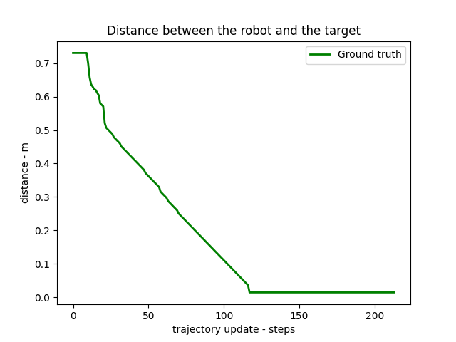
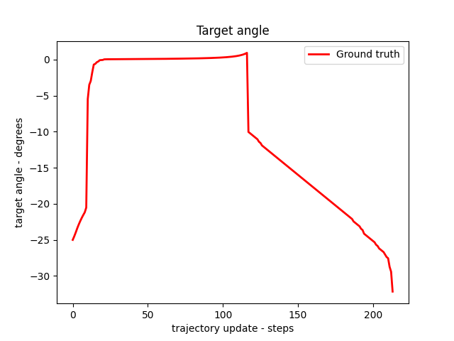
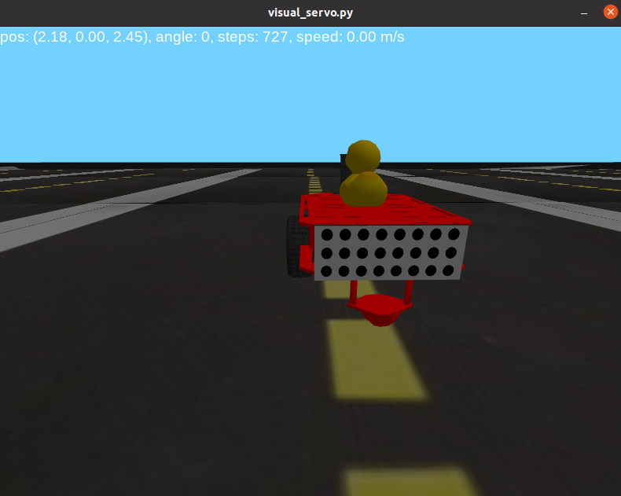

#  Duckling controller : Project report {#duckling_controller-final-report status=ready}

## The final result {#duckling_controller-final-result}

[Here's](https://youtu.be/uOWxnWE0eHQ) the final result on the simulator. ([README.md](https://github.com/Frank-Hebert/lane_control/blob/main/README.md))

<p>&nbsp;</p>

[Here's](https://youtu.be/NsuGWjWAxIg) the final result on the duckiebot.  ([README.md](https://github.com/jerome-labonte-udem/duckietown-visual-servo/tree/daffy/visual_servo))

<p>&nbsp;</p>

You can reproduce these demonstrations by following the steps from the [instructions](#instructions-duckling_controller).


## Mission and Scope {#duckling_controller-final-scope}

Our mission is to create a controller that is capable of using images from the duckiebot's camera to follow an other duckiebot and stop a certain distance away, in line with its rear. We would like to implement this controller in the duckiebot and also a similar controller that would be able to only stop behind another duckiebot using the simulator.
<p>&nbsp;</p>
Our duckiebot has a camera with a fisheye lens installed on it. This configuration is called eye-in-hand because it is rigidly mounted on the robot. Our target is at a certain distance from the bumper of other duckiebot. The bumper has a circle pattern: 8 columns by 3 rows on the simulator and 7 columns by 3 rows on the duckiebot.
<p>&nbsp;</p>


*Figure 1 : Duckiebot's fisheye camera*


*Figure 2 : Duckiebot's bumper*

## Motivation {#duckling_controller-final-result-motivation}

This project is challenging as it has many applications. Visual servoing can be used to pick up an object from one place and place it in another or to follow and track an object by an autonomous vehicle.
<p>&nbsp;</p>

This project is of great importance as it has many applications. Visual servoing can be used to pick up an object from one place and place it in another, or to follow and track an object by an autonomous vehicle.


## Existing solution {#duckling_controller-final-literature}

Visual servoing is the use of visual sensors to control the motion of the robot. There are three main approaches to tackle this challenge. One is called positional-based visual servo (PBVS), another is called Image-based visual servo (IBVS) and the third one is a hybrid that combines the two first. For more information about both methods, we looked at “A tutorial on visual servo control”[1] and at "A Comparison between Position-Based and Image-Based Dynamic Visual Servoings in the Control of a Translating Parallel Manipulator"[2].

<p>&nbsp;</p>

1. *S. Hutchinson, G. D. Hager, and P. I. Corke, “A tutorial on visual servo control,” IEEE Transactions on Robotics and Automation, vol. 12, no. 5, pp. 651–670, 1996.*
2. *G. Palmieri, M. Palpacelli, M. Battistelli, and M. Callegari, "A Comparison between Position-Based and Image-Based Dynamic Visual Servoings in the Control of a Translating Parallel Manipulator"*


### Positional-based visual servo (PBVS) {#duckling_controller-final-pbvs}

The PBVS task is defined in the 3D Cartesian frame. The visual data tries to reconstruct the 3D pose of the camera and the kinematic error is generated in Cartesian space.
<p>&nbsp;</p>
To perform a PBVS, the follow steps is necessary:

<p>&nbsp;</p>

1. 3D camera calibration:
    * Intrinsic parameters that depends exclusively on the camera, such as its optical center and focal length;
    * Extrinsic parameters represents the location of the camera in the 3D scene.
2. Estimate the POSE at certain frequency since it depends on the motion of the camera and/or the target.
3. Control the motion of the robot in order minimize the kinematic error.

<p>&nbsp;</p>

This method is very sensitive to calibrations errors.

### Image-based visual servo (IBVS) {#duckling_controller-final-ibvs}

The image-based visual servo control the error is calculated in 2D image feature parameters.

<p>&nbsp;</p>

1. Define the interaction matrix that relates the Cartesian velocity with the image space velocity. This matrix depends on: the focal length expressed in pixel, image-space vectors s = {u, v, d}^T, and the z estimated.

2. Control the motion of the robot to minimize the distance between the target and current pixels. It is necessary to invert the interaction matrix for each step of the control to have the camera motion.

### Opportunity {#duckling_controller-final-opportunity}

We took inspiration from an existing package made by another colaborator (Frank-qcd-qk) that was in the [dt-core](https://github.com/duckietown/dt-core) folder. The package is called [vehicule_detection](https://github.com/duckietown/dt-core/tree/daffy/packages/vehicle_detection) and recognizes the pattern on the back of another duckiebot.  The pattern detection is performed using OpenCV's [*findCirclesGrid*](https://docs.opencv.org/2.4/modules/calib3d/doc/camera_calibration_and_3d_reconstruction.html?highlight=solvepnp#findcirclesgrid) function. From this function, we can then calculate the pose of the bumper by using an other function from OpenCv called [solve.PnP](https://docs.opencv.org/3.4/d9/d0c/group__calib3d.html).


## Background and Preliminaries {#duckling_controller-final-preliminaries}

### Pose estimation


The homography relates the transformation between two planes, as shown below:


It is a 3 x 3 matrix with 8 DoF since it's generally normalized with h_33 = 1
<p>&nbsp;</p>
The function solvePnP from OPENCV allows to compute the camera pose from the correspondences (3D object points expressed in the object frame) and the projected 2D image points (object points viewed in the image). The intrinsic parameters and the distortion coefficients are required as inputs in the function. We do have the intrinsic values of the duckiebot camera (from the calibration file), but we don't have it for simulation. It led to some inaccuracy in the POSE estimation in the simulator.


## Definition of the problem {#duckling_controller-final-problem-def}

Our project has two main objectives:

<p>&nbsp;</p>

1. **For the duckiebot**: Follow an other duckiebot and stop at a certain distance from it
  
2. **For the simulator**: Park behind a duckiebot

<p>&nbsp;</p>

For both objectives to be achieved, we first need to define the control strategy. As explained in the previous section there are PBVS, IBVS, and hybrids.

<p>&nbsp;</p>

In the case of our project, we chose PBVS which is a closed-loop control system where the feedback loop is the POSE of our goal. The objective of this controller is to minimize this POSE. We consider that we have reached our goal when the POSE falls below an established range.

<p>&nbsp;</p>

With this strategy, to reach our goal we need three steps:

<p>&nbsp;</p>

1. Find the position and orientation (POSE) of the rear of another duckiebot in relation to the camera installed in the duckiebot to be controlled.
2. Establish how far we want to be behind the duckiebot and update the POSE of our goal.
3. Control the duckiebot's movement to reduce the distance and the angle between our duckiebot and our target.

<p>&nbsp;</p>

This is a closed-loop control system, where the POSE of our objective is being updated with a certain frequency. Therefore, the controller is always looking to minimize the distance from the target.

## Contribution / Added functionality {#duckling-controller-final-contribution}

### Description {#duckling-controller-final-contribution-description}

We implemented two architectures, one for the simulator and one for the duckiebot. They are similar in structure but different in their details. Both can estimate the position of our duckiebot in relation to the rear of the other, both predict the position of our duckiebot if we lose sight of the target and both are able to reach the desired target.
However, their predict methods (when there is no detection) are different. On the duckiebot, we have access to the wheel encoders to update our position. In the simulator, we simply use the last commands used and the duration to update the belief.

We will explain in more detail below the architecture and main features for the simulator and the duckiebot.

## Simulator {#duckling_controller-final-simulator}

### Architecture {#duckling_controller-final-architecture-sim}


Here are the main components of this project.

<p>&nbsp;</p>

* *config.py* contains the configuration values
* *visual_servo.py* is the main script that puts the estimation.py and control.py together
* *estimation.py* contains everything related to estimating the relative pose of the target point to the robot
* *control.py* contains everything related to generating the duckiebot commands from the pose estimation

<p>&nbsp;</p>

##### Visual servo {#duckling_controller-final-visualservo-sim}

<p>&nbsp;</p>

This script is implemented in *visual_servo.py* and is allowing you to manually control duckiebot using the keyboard arrows and toggles visual servoing to go park behind another duckiebot if detected. There are two options implemented in the simulator.

<p>&nbsp;</p>

With the first option, we can estimate the pose based on the image, and the schema is represented below:


*Figure 3 : First option in the simulator using the estimated pose*

<p>&nbsp;</p>

With the second one, we use directly the ground truth information about the object location as the schema below:


*Figure 4 : Second option in the simulator using the ground truth*

<p>&nbsp;</p>

##### Estimator {#duckling_controller-final-estimator-sim}

<p>&nbsp;</p>

This module is implemented in *estimator.py* and contains the logic to estimate the pose of the duckiebot relative to a circle pattern (bumper). 


*Figure 5 : Estimation of the POSE*

<p>&nbsp;</p>

In order to estimate our POSE, we use the SolvePnP method implemented in OpenCV. We need four inputs and it computes the relative rotation and translation matrices of our target.

<p>&nbsp;</p>

**Inputs of SolvePnP** :

<p>&nbsp;</p>

-	**objectPoints**: Array of object points in the object coordinate space. In our case, it's the circle’s pattern of the bumper of the duckiebot. It has the coordinate of each one of the circles. It is a matrix [24 x 3] in the simulator and [21 x 3] in the bot because there are 24 dots on the bumper in the simulator and 21 circles on the real robot. Here's an example of this matrix for the simulation:

```
objectPoint =
		[[-0.04 -0.01  0.  ]
 		[-0.03 -0.01  0.  ]
			. . .
 		[ 0.03 -0.01  0.  ]
 		[ 0.04 -0.01  0.  ]
 		[-0.04  0.    0.  ]
 		[-0.03  0.    0.  ]
	 		. . . 
 		[ 0.03  0.    0.  ]
 		[ 0.04  0.    0.  ]
 		[-0.04  0.01  0.  ]
 		[-0.03  0.01  0.  ]
			. . .
 		[ 0.03  0.01  0.  ]
 		[ 0.04  0.01  0.  ]]
```
<p>&nbsp;</p>

-	**imagePoints**: Array of corresponding image points, Nx2 1-channel or 1xN/Nx1 2-channel, where N is the number of points. In our case, it has the center of the circle’s and it changes everytime before entering in SOLVEPNP and it depends on the image got from the camera. The format of this matrix is 24 x 2 in the simulator and 21 x 2 in the bot.

<p>&nbsp;</p>

-	**cameraMatrix**: it contains the intrinsic parameters of the camera like focal length(fx, fy) and optical center (cy, cy). It is a 3 x 3 matrix as follow:


On the duckiebot, we were able to use the parameters from the calibration file, but for the simulation, we tried different combinations of parameters since we don’t know the exact values. This led to the error in our pose estimation. We are going to discuss it in the results.

<p>&nbsp;</p>

-	**distCoeffs**: Input vector of distortion coefficients of 4, 5, 8, 12 or 14 elements. In our case it is a vector with five elements: (k1 k2 p1 p2 k3). 

From these five, three parameteres: k1, k2 and k3 are for radial distortion that is shown in the picture below from this [website](https://www.mathworks.com/help/vision/ug/camera-calibration.html) where it has more details on how to calculate them. 


*Figure 6 : Radial distortion*

<p>&nbsp;</p>

For the others two: p1 and p2 are for tangencial distortion which is shown in the picture below from the same website.


*Figure 7 : Tangential distortion*


<p>&nbsp;</p>

##### Controller {#duckling_controller-final-controller-sim}

<p>&nbsp;</p>

This module is implemented in *control.py* and computes duckiebot commands from estimated pose to a target.


*Figure 8 : Controller for the simulator*

<p>&nbsp;</p>

The controller implemented could be summarized in the steps below:

<p>&nbsp;</p>

1. The duckiebot rotates to go in the direction of the target;
	  
2. The duckiebot goes at constant linear velocity to the target;
	  
3. The duckiebot rotates again if it is not aligned to the bumber.

<p>&nbsp;</p>

The steps one and two could be performed several times  while the step three is performed just once when we achieve our target distance. In the case where the pose is perfecly estimated, we could represent by this drawing:


*Figure 9 : Steps representation of the controller*

<p>&nbsp;</p>

In order to better understand the next flowchart, the variables and parameters are defined below.

<p>&nbsp;</p>

-	**distance**:				distance between our bot and the target. The target is at a certain distance behind the bumper. 
-	**angle to target**:			angle between our bot and the target. 
-	**angle to goal pose**:			angle between our bot and the bumper.
-	**V_constant**:				constant linear velocity.
-	**W_constant**:				constant angular velocity
-	**threshold distance**:			distance below which we achieve our task.
-	**threshold angle**:			angle below which we achieve our task.
-	**threshold pure pursuit distance**:	distance that allows to pursue a moving target.


*Figure 10 : Complete representation of the simulator controller*
## Duckiebot {#duckling_controller-final-duckiebot}

### Architecture {#duckling_controller-final-architecture-robot}

These are the main components for the duckiebot system.

<p>&nbsp;</p>

* *config.py* contains the configuration values
* *lane_controller_node.py* is the main script that puts the estimation.py and control.py together
* *estimation.py* contains everything that is related to estimating the relative pose of the target point to the robot.
* *control.py* contains everything that is related to generating the duckiebot commands from the pose estimation.

<p>&nbsp;</p>

##### Visual servo {#duckling_controller-final-visualservo-robot}

<p>&nbsp;</p>

The *lane_controller_node.py* is the script for the control node implemented. It has four subscribers and one publisher as we can see in the graph below. 


*Figure 11 : Subscribers and publisher of the lane_controller_node.py*

<p>&nbsp;</p>

The first two subscribers are used to get the camera image and the intrinsic camera parameters. They are necessary to estimate the position and orientation of our duckiebot with respect to the target. The last two are used to predict our position by using the robot kinematics in case we lose sight of our target. Once we have information about the target, we rely on this information, thus not using the predicted data. A Kalman filter would be a nice upgrade for future exploration.


Once the commands are given, and the robot is moving, we process the new images. It is worth saying that we can control the movement of the robot also by controlling the keyboard as described below.


*Figure 12 : Flowchart of the controller*

<p>&nbsp;</p>

##### Estimator {#duckling_controller-final-estimator-robot}

<p>&nbsp;</p>

The estimator is similar to the one implemented in the simulator. In this case we have the camera calibration which makes the estimation more reliable.

<p>&nbsp;</p>

##### Controller {#duckling_controller-final-controller-robot}

<p>&nbsp;</p>


*Figure 13 : Summary of the controller*

<p>&nbsp;</p>

The controller implemented could be summarized in below:

1.	The duckiebot rotates and translates to go in the direction of the target;
2.	The duckiebot stops moving when it reaches de target distance;
3.	The duckiebot stops rotating when it reaches the correct angle.


*Figure 14 : Logic of the controller*

<p>&nbsp;</p>


## Formal performance evaluation / Results {#duckling_controller-final-formal}


### Simulator - Performance/Results

We evaluate the performance of the controller by answering the questions:

<p>&nbsp;</p>

- Could it arrive at the right place with the right angle?
- Was it stable?
- How many steps are required to get to the target?
- How far the calculated POSE is from the truth?

<p>&nbsp;</p>

For the simulator we have two configurations: 

<p>&nbsp;</p>

1. with the ground truth target POSE.
2. with estimated POSE.

<p>&nbsp;</p>

#### With the ground truth target POSE

<p>&nbsp;</p>

Since we have the ground truth position, we can evaluate just the controller by setting the target at certain distance of the bumper. 

In this case, the controller worked the way we expected. Our duckiebot is able to rotate, go to the target and then, rotate back to be aligned with the bumper within few update steps.


*Figure 15 : Initial position while using the ground truth information*


*Figure 16 : Final position while using the ground truth information*



*Figure 17 : Distance between the robot and the target*



*Figure 18 : Values of the target angle*


*Figure 19 : Values of the goal angle*

<p>&nbsp;</p>

#### With estimated POSE

<p>&nbsp;</p>

In this case, it is able to get to the target, but we have some errors in the pose estimation. Probably due to the camera parameters in the simulation. We tried different combinations and these following results are the best one we got.


*Figure 20 : Distortion coefficients used*


*Figure 21 : Instrinsic camera parameters used (best ones)*


*Figure 22 : Initial position while using the estimated pose*


*Figure 23 : Final position while using the estimated pose*


*Figure 24 : Distance between the robot and the target*


*Figure 25 : Values of the target angle*



*Figure 26 : Values of the goal angle*

<p>&nbsp;</p>

For comparison, this is a possible result obtained, using the same distortion coefficients and modifying only the matrix of intrinsic parameters.


*Figure 27 : Instrinsic camera parameters (worst ones)*

<p>&nbsp;</p>

The robot POSE estimation was worse and as a result, our performance worsened a lot in all the metrics used:

- it oscillated more;
- it took longer to get close to the target;
- in the end it became more distant, and with a greater angles.


*Figure 28 : Initial position while using the worst camera parameters*


*Figure 29 : Final position while using the worst camera parameters*


*Figure 30 : Distance between the robot and the target using the worst camera parameters*


*Figure 31 : Values of the target angle using the worst camera parameters*


*Figure 32 : Values of the goal angle using the worst camera parameters*


### Duckiebot - Performance/Results

For the performance on the duckiebot we could not plot results, but here is what we noticed:

<p>&nbsp;</p>

-  We got good [results](https://www.youtube.com/watch?v=NsuGWjWAxIg);
-  It could estimate our relative position and orientation better because we had the right camera parameters;
-  It was able to go faster when the target was far and slow when it was closer;
-  The robot can oscillate when he's near the other bumper. By sending a command high enough to fight the static friction, it can overshoot the target and it will then repeat this pattern again and again.


## Future avenues of development {#duckling_controller-final-next-steps}


We are, in general, satisfied with the results obtained, but many there are many other things that could be explored. Here is a list of suggestions:

<p>&nbsp;</p>

- One could try to get better parameters for the camera in the simulator by doing a calibration with images from the simulator;
- One could implement a Kalman filter;
- One could implement some restrictions to the motion. For example: the car can only move in the lane or avoid running over a duckie if it is in the way. No such restrictions are implemented;
- A PID controller can be implemented.
