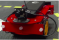

#  Group name: Project report {#duckling_controller-final-report status=ready}

## The final result {#duckling_controller-final-result}

_Let's start from a teaser._

* Post a video of your best results (e.g., your demo video): remember to have duckies on the robots or something terrible might happen!

You might want to add as a caption a link to your [instructions to reproduce](#instructions-duckling_controller) to reproduce these results.
Moreover, add a link to the readme.txt of your code.

## Mission and Scope {#duckling_controller-final-scope}

Our mission is to create a controller that is capable of using images from the duckiebot's camera to follow another duckiebot and stop a certain distance away, in line with its rear. We would like to implement this controller in the duckiebot and also a similar controller that would be able to only stop behind another duckiebot using the simulator.

Our duckiebot has a camera with fisheye lens installed on it. This configuration is called eye-in-hand because it is rigidly mounted on the robot. Our target is at a certain distance of the bumper of other duckiebot. The bumper has a circle's pattern: 8 columns by 3 rows on simulator and 7 columns by 3 rows on the duckiebot.

## Motivation {#duckling_controller-final-result-motivation}

This project is a visual servo controller that is a technique of using visual sensors to control the movements of a robot. 

This project is of great importance as it has many applications. Visual servoing can be used to pick up an object from one place and place it in another, or to follow and track an object by an autonomous vehicle.

## Existing solution {#duckling_controller-final-literature}

Visual servoing is the use of visual sensors in order to control the motion of the robot. There are three main approach to tackle this problem. One is called positional-based visual servo (PBVS), another is called Image-based visual servo (IBVS) and the third one is an hybrid that combines the two first. For more information about both methods [1] and a comparison in results [2]

1) S. Hutchinson, G. D. Hager, and P. I. Corke, “A tutorial on visual servo control,” IEEE Transactions on Robotics and Automation, vol. 12, no. 5, pp. 651–670, 1996.

2) G. Palmieri, M. Palpacelli, M. Battistelli, and M. Callegari, "A Comparison between Position-Based and Image-Based Dynamic Visual Servoings in the Control of a Translating Parallel Manipulator"

### Positional-based visual servo (PBVS) {#duckling_controller-final-pbvs}

The positional-based visual servo control the task is defined in 3D Cartesian frame. The visual data tries to reconstruct the 3D pose of the camera and the kinematic error is generated in Cartesian space.

In order to perform a PBVS, the follow steps is necessary:

1) 3D camera calibration:
	- Intrinsic parameters that deppends exclusively on the camera, such as its optical center and focal length;
	- Extrinsic parameters represents the location of the camera in the 3D scene.
2) Estimate the POSE at certain frequency since it deppends on the motion of the camera and/or the target.
3) Control the motion of the robot in order minimize the kinematic error.

This method is very sensitive to calibrations errors.

### Image-based visual servo (IBVS) {#duckling_controller-final-ibvs}

The image-based visual servo control the error is calculated in 2D image feature parameters.

1) Define the interaction matrix Le that relates the Cartesian velocity with the image space velocity. This matrix depends on: the focal length expressed in pixel, image-space vectors s = {u, v, d}^T, and the z estimated.
2) Control de motion of the robot to minimize the distance between the target and current pixels. It is necessary to invert the interaction matrix for each step of the control in order to have the camera motion.

### Opportunity {#duckling_controller-final-opportunity}

We use package made by another colaborator that was in the dt-core folder. The package is called ... and recognizes the pattern on the back of another duckiebot.

(A COMPLETER)

* How did you go about improving the existing solution / approaching the problem? [contribution]

Examples:
- We used method / algorithm xyz to fix the gap in knowledge (don't go in the details here)
- Make sure to reference papers you used / took inspiration from, lessons, textbooks, third party projects and any other resource you took advantage of (check [here](+duckumentation#bibliography-support) how to add citations in this document). Even in your code, make sure you are giving credit in the comments to original authors if you are reusing some components.

## Background and Preliminaries {#duckling_controller-final-preliminaries}

* Is there some particular theorem / "mathy" thing you require your readers to know before delving in the actual problem? Briefly explain it and links for more detailed explanations here.

Definition of link:
- could be the reference to a paper / textbook
- (bonus points) it is best if it is a link to Duckiebook chapter (in the dedicated "Preliminaries" section)

## Definition of the problem {#duckling_controller-final-problem-def}

_Up to now it was all fun and giggles. This is the most important part of your report: a crisp, possibly mathematical, definition of the problem you tackled. You can use part of the preliminary design document to fill this section._

Make sure you include your:
- final objective / goal
- assumptions made
- quantitative performance metrics to judge the achievement of the goal

## Contribution / Added functionality {#duckling_controller-final-contribution}

Describe here, in technical detail, what you have done. Make sure you include:
- a theoretical description of the algorithm(s) you implemented
- logical architecture
- software architecture
- details on the actual implementation where relevant (how does the implementation differ from the theory?)
- any infrastructure you had to develop in order to implement your algorithm
- If you have collected a number of logs, add link to where you stored them

_Feel free to create subsections when useful to ease the flow_

## Formal performance evaluation / Results {#duckling_controller-final-formal}

_Be rigorous!_

- For each of the tasks you defined in you problem formulation, provide quantitative results (i.e., the evaluation of the previously introduced performance metrics)
- Compare your results to the success targets. Explain successes or failures.
- Compare your results to the "state of the art" / previous implementation where relevant. Explain failure / success.
- Include an explanation / discussion of the results. Where things (as / better than / worst than) you expected? What were the biggest challenges?

## Future avenues of development {#duckling_controller-final-next-steps}

_Is there something you think still needs to be done or could be improved? List it here, and be specific!_
